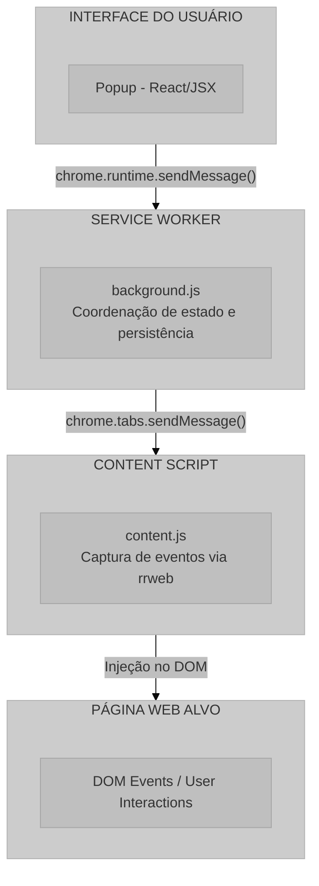
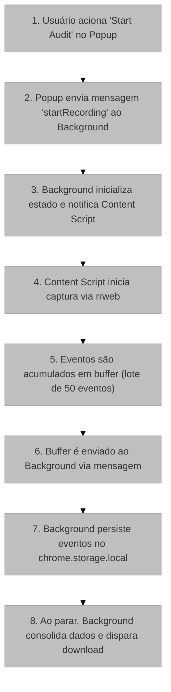

# UX Auditor Extension: Visão Geral do Sistema

## 1. Introdução

O **UX Auditor Extension** é uma extensão de navegador desenvolvida para o Google Chrome que permite a captura, gravação e exportação de sessões de interação do usuário em páginas web. O sistema foi projetado para auxiliar pesquisadores e profissionais de Experiência do Usuário (UX) na coleta de dados comportamentais para análise posterior.

## 2. Propósito e Aplicação

### 2.1 Contexto de Pesquisa

A ferramenta insere-se no contexto de pesquisa em Interação Humano-Computador (IHC) e UX, fornecendo um mecanismo não intrusivo para captura de dados de interação. Diferentemente de soluções comerciais que dependem de serviços em nuvem, esta extensão opera inteiramente no ambiente local do navegador, garantindo privacidade dos dados coletados.

### 2.2 Casos de Uso

- **Testes de Usabilidade Remotos**: Captura de sessões para análise assíncrona
- **Pesquisa Acadêmica**: Coleta de dados comportamentais para estudos em IHC
- **Auditoria de Interface**: Documentação de fluxos de interação
- **Análise Heurística**: Registro de interações para avaliação posterior

## 3. Arquitetura do Sistema

### 3.1 Visão Macroscópica

O sistema segue a arquitetura padrão de extensões Chrome Manifest V3, composta por três camadas principais:

**Diagrama de arquitetura macroscópica mostrando a interação entre a Interface do Usuário (Popup), o Service Worker (Background), o Content Script e a Página Web alvo.**

### 3.2 Componentes do Sistema

| Componente | Arquivo | Responsabilidade |
|------------|---------|------------------|
| Manifesto | [`manifest.json`](../manifest.json) | Configuração e metadados da extensão |
| Service Worker | [`background.js`](../src/scripts/background.js) | Orquestração e persistência de estado |
| Content Script | [`content.js`](../src/scripts/content.js) | Captura de eventos de interação |
| Interface Popup | [`Popup.jsx`](../src/popup/Popup.jsx) | Interação com o usuário |
| Estilos | [`popup.css`](../src/popup/popup.css) | Apresentação visual |

## 4. Fluxo de Dados

### 4.1 Sequência de Gravação

O fluxo de dados durante uma sessão de gravação segue o seguinte padrão:

**Fluxograma da sequência de gravação, desde o acionamento pelo usuário até a persistência e download dos dados.**

### 4.2 Modelo de Comunicação

A comunicação entre componentes utiliza a API de mensagens do Chrome:

$$
\text{Comunicação} = \begin{cases}
\text{Popup} \xrightarrow{\text{runtime.sendMessage}} \text{Background} \\
\text{Background} \xrightarrow{\text{tabs.sendMessage}} \text{Content Script} \\
\text{Content Script} \xrightarrow{\text{runtime.sendMessage}} \text{Background}
\end{cases}
$$

## 5. Tecnologias Utilizadas

### 5.1 Stack Tecnológico

| Tecnologia | Versão | Finalidade |
|------------|--------|------------|
| React | 19.2.0 | Interface de usuário componentizada |
| rrweb | 2.0.0-alpha.4 | Captura e reprodução de sessões |
| Vite | 7.2.4 | Build system e desenvolvimento |
| CRXJS | 2.0.0-beta.33 | Integração Vite + Chrome Extension |
| Chrome Extensions API | Manifest V3 | APIs nativas do navegador |

### 5.2 Justificativa das Escolhas

**rrweb**: Selecionado por sua capacidade de gravar e reproduzir sessões web com alta fidelidade, utilizando uma abordagem baseada em mutações do DOM e eventos de entrada. A biblioteca é amplamente utilizada em ambientes de produção por empresas como Mozilla e LogRocket.

**React**: Escolhido pela sua eficiência na construção de interfaces declarativas e pelo ecossistema maduro de ferramentas. A versão 19 introduziu melhorias no sistema de hooks e renderização.

**Vite + CRXJS**: A combinação permite desenvolvimento moderno com Hot Module Replacement (HMR) para extensões Chrome, acelerando significativamente o ciclo de desenvolvimento.

## 6. Considerações de Privacidade

O sistema implementa as seguintes medidas de proteção de dados:

1. **Mascaramento de Inputs**: Todos os campos de entrada são automaticamente mascarados via configuração `maskAllInputs: true` do rrweb
2. **Armazenamento Local**: Dados permanecem exclusivamente no dispositivo do usuário
3. **Sem Telemetria**: Nenhum dado é transmitido para servidores externos

## 7. Estrutura da Documentação

A documentação técnica está organizada nos seguintes arquivos:

1. **[Manifesto](./01-manifesto.md)**: Configuração e permissões da extensão
2. **[Service Worker](./02-service-worker.md)**: Lógica de orquestração e persistência
3. **[Content Script](./03-content-script.md)**: Mecanismo de captura de eventos
4. **[Interface Popup](./04-interface-popup.md)**: Componentes de interação
5. **[Sistema de Build](./05-sistema-build.md)**: Configuração e empacotamento
6. **[Referências](./06-referencias.md)**: Bibliografia e recursos

## 8. Referências

> Chrome Developers. (2024). *Chrome Extensions Documentation - Manifest V3*. Disponível em: https://developer.chrome.com/docs/extensions/mv3/

> rrweb. (2024). *rrweb: Record and Replay the Web*. Disponível em: https://www.rrweb.io/
