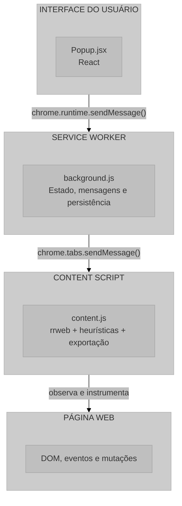
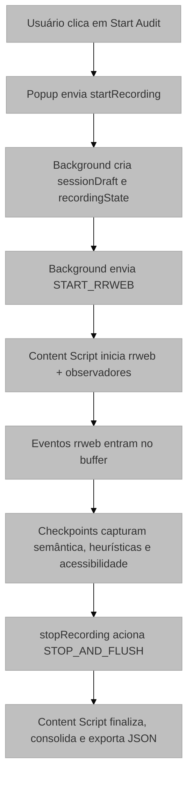

# UX Auditor Extension: Visão Geral do Sistema

## 1. Introdução

O **UX Auditor Extension** é uma extensão Chrome para captura e análise local de sessões de interação em páginas web. A ferramenta registra eventos de navegação e interação, consolida metadados semânticos da interface e exporta um pacote de sessão que pode ser analisado posteriormente em contexto acadêmico ou de auditoria de UX.

O sistema foi desenhado para operar sem infraestrutura de servidor, priorizando armazenamento local, processamento no navegador e geração de evidências estruturadas para revisão manual ou automatizada.

## 2. Propósito e Aplicação

### 2.1 Contexto de Pesquisa

A extensão se insere em pesquisa de Interação Humano-Computador e Experiência do Usuário como um instrumento de captura não intrusivo. Em vez de depender de telemetria em nuvem, o processamento principal ocorre no próprio navegador, reduzindo a exposição dos dados coletados e simplificando a conformidade com privacidade.

### 2.2 Casos de Uso

- **Testes de Usabilidade Remotos**: Captura de sessões para análise assíncrona
- **Pesquisa Acadêmica**: Coleta de dados comportamentais para estudos em IHC
- **Auditoria de Interface**: Documentação de fluxos de interação
- **Análise Heurística**: Registro de interações para avaliação posterior

## 3. Arquitetura do Sistema

### 3.1 Visão Macroscópica

O sistema segue a arquitetura típica de uma extensão Chrome Manifest V3, com quatro camadas principais:

- **Popup**: interface de controle da gravação
- **Service Worker**: orquestração, persistência e finalização
- **Content Script**: captura, enriquecimento e exportação da sessão
- **Página Web**: contexto observado, onde os eventos acontecem

### 3.2 Componentes do Sistema

| Componente | Arquivo | Responsabilidade |
|------------|---------|------------------|
| Manifesto | [`manifest.json`](../manifest.json) | Configuração e metadados da extensão |
| Service Worker | [`background.js`](../src/scripts/background.js) | Orquestração e persistência de estado |
| Content Script | [`content.js`](../src/scripts/content.js) | Captura, análise e exportação da sessão |
| Interface Popup | [`Popup.jsx`](../src/popup/Popup.jsx) | Controle de gravação e status |
| Build | [`vite.config.js`](../vite.config.js) | Integração do bundling com a extensão |

## 4. Fluxo de Dados

### 4.1 Sequência de Gravação

O fluxo atual de uma sessão segue este encadeamento:

1. O usuário inicia a gravação no Popup
2. O Service Worker cria `recordingState` e `sessionDraft`
3. O Content Script inicia `rrweb.record()` com mascaramento seletivo
4. Eventos rrweb são acumulados em lotes de 50
5. O Content Script coleta semântica da página, métricas de interação e dados de acessibilidade
6. Ao encerrar a sessão, o buffer é esvaziado, o estado é finalizado e o JSON é exportado localmente

O arquivo final gerado não é apenas um replay rrweb. Ele é um objeto de sessão que agrega, de forma incremental, dados brutos e dados derivados.

| Bloco | Conteúdo principal |
|-------|--------------------|
| `rrweb` | eventos brutos da página |
| `session_meta` | identificação da sessão, tempo e contexto de navegador |
| `privacy` | modo de mascaramento e regras de sensibilidade |
| `capture_config` | parâmetros de captura usados na sessão |
| `page_semantics` | landmarks, elementos interativos e grupos de formulário |
| `interaction_summary` | caminhos de ponteiro, digitação, foco, rolagem e candidatos heurísticos |
| `ui_dynamics` | mutações, sinais de shift e feedback visual |
| `axe_preliminary_analysis` | resumo de acessibilidade preliminar |
| `heuristic_evidence` | evidências de usabilidade e acessibilidade derivadas de checkpoints |
| `ux_markers` | marcadores pontuais gerados durante a captura |

### 4.2 Modelo de Comunicação

A comunicação entre componentes utiliza a API de mensagens do Chrome:

$$
\text{Comunicação} =
\begin{cases}
\text{Popup} \xrightarrow{\text{runtime.sendMessage}} \text{Service Worker} \\
\text{Service Worker} \xrightarrow{\text{tabs.sendMessage}} \text{Content Script} \\
\text{Content Script} \xrightarrow{\text{runtime.sendMessage}} \text{Service Worker}
\end{cases}
$$

## 5. Tecnologias Utilizadas

### 5.1 Stack Tecnológico

| Tecnologia | Versão | Finalidade |
|------------|--------|------------|
| React | 19.2.0 | Interface do popup |
| rrweb | 2.0.0-alpha.4 | Captura e reprodução de sessões |
| axe-core | 4.10.0 | Análise preliminar de acessibilidade |
| Vite | 7.2.4 | Build e desenvolvimento |
| CRXJS | 2.0.0-beta.33 | Integração Vite + Chrome Extension |
| Chrome Extensions API | Manifest V3 | APIs nativas do navegador |

### 5.2 Justificativa das Escolhas

**rrweb** foi mantido por permitir captura de eventos com alto nível de fidelidade e por ser adequado a replay de sessões sem dependência de backend.  
**React** simplifica a construção da interface de controle da gravação.  
**Vite + CRXJS** reduz o custo de desenvolvimento e mantém o empacotamento compatível com extensões Chrome.  
**axe-core** adiciona uma varredura inicial de acessibilidade diretamente na sessão capturada.

Essa arquitetura faz com que a exportação final sirva tanto para replay quanto para auditoria: o mesmo JSON carrega a trilha de eventos e a leitura local da interface feita durante a sessão.

## 6. Considerações de Privacidade

O sistema usa uma estratégia híbrida de privacidade:

1. `maskAllInputs` está desativado no rrweb para não aplicar uma máscara genérica e cega em todos os campos.
2. Campos sensíveis são mascarados por heurística e contexto, usando `maskInputFn` e `shouldMaskSensitiveField`.
3. O conteúdo final exportado permanece local no dispositivo do usuário.
4. Perfis de valor e sinais de formato são armazenados como metadados heurísticos, não como dependência de um tipo específico de campo.

Isso permite capturar problemas como um campo numérico sem máscara aparente, ao mesmo tempo em que evita expor valores brutos em evidências secundárias.

## 7. Estrutura da Documentação

A documentação técnica está organizada nos seguintes arquivos:

1. **[Manifesto](./01-manifesto.md)**: configuração e permissões da extensão
2. **[Service Worker](./02-service-worker.md)**: orquestração e persistência
3. **[Content Script](./03-content-script.md)**: captura, semântica e heurísticas
4. **[Interface Popup](./04-interface-popup.md)**: controles e estado visual
5. **[Sistema de Build](./05-sistema-build.md)**: empacotamento e infraestrutura
6. **[Referências](./06-referencias.md)**: bibliografia e recursos

## 8. Referências

> Chrome Developers. (2024). *Chrome Extensions Documentation - Manifest V3*. Disponível em: https://developer.chrome.com/docs/extensions/mv3/

> rrweb. (2024). *rrweb: Record and Replay the Web*. Disponível em: https://www.rrweb.io/
