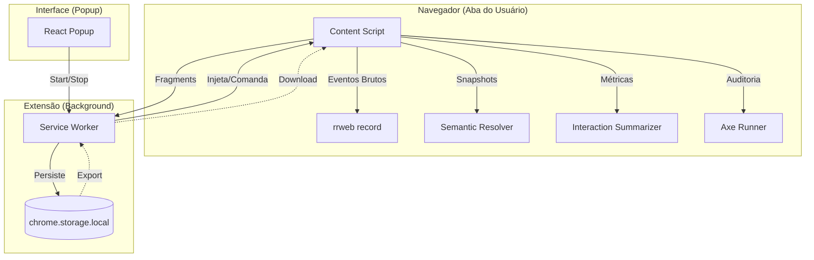

# Visão Geral do UX Auditor Extension

## 1. Objetivo e Proposta de Valor

O **UX Auditor Extension** é uma ferramenta avançada de auditoria de experiência do usuário (UX) projetada para capturar e enriquecer sessões de uso no navegador. Diferente de ferramentas de replay convencionais (como Hotjar ou FullStory) que focam primariamente na reprodução visual, o UX Auditor foca na **interpretação semântica e comportamental** da interação.

### Diferenciais Principais:
- **Enriquecimento Semântico**: Não apenas grava o que o usuário fez, mas *em que* ele fez, utilizando papéis ARIA, nomes acessíveis e landmarks para dar contexto à interação.
- **Métricas de Performance Humana**: Calcula latência de decisão (tempo até o primeiro clique/input), hesitação em campos e eficiência de movimento do ponteiro.
- **Heurísticas Automatizadas**: Identifica automaticamente padrões de fricção como *rage clicks*, *dead clicks* e abandono de campos em tempo real.
- **Privacidade por Design**: Implementa mascaramento seletivo de dados sensíveis diretamente no coletor, garantindo conformidade com LGPD/GDPR sem sacrificar a análise contextual.
- **Acessibilidade Nativa**: Integra o motor `axe-core` para realizar auditorias WCAG preliminares em checkpoints estratégicos (carga de página, submissão de formulários).

---

## 2. Arquitetura do Sistema

O sistema opera como uma extensão Manifest V3, distribuindo responsabilidades entre três camadas principais:

### Componentes:
1.  **Service Worker (Background)**:
    - Atua como o cérebro da sessão.
    - Mantém o estado global (se está gravando ou não).
    - Recebe "fragmentos" de dados do Content Script e os persiste incrementalmente no `chrome.storage.local` para evitar perda de dados em caso de crash.
2.  **Content Script**:
    - O agente executor injetado em cada página.
    - Orquestra o pipeline de captura: `rrweb` para o visual, `SemanticResolver` para o contexto e `InteractionSummarizer` para o comportamento.
3.  **Popup (React)**:
    - Interface minimalista para o pesquisador iniciar e finalizar a auditoria.
    - Exibe o tempo decorrido da sessão em tempo real através do badge da extensão.

---

## 3. Filosofia de Dados: Fragmentos e Checkpoints

Para gerenciar o grande volume de dados sem impactar a performance do navegador (`Main Thread`), o sistema utiliza duas estratégias:

1.  **Pipeline de Fragmentos**: Os dados não são enviados de uma vez no final. Eles são bufferizados e enviados como pequenos fragmentos JSON toda vez que o buffer atinge um limite ou após um período de inatividade.
2.  **Checkpoints Analíticos**: O sistema dispara análises profundas (Axe, varredura semântica completa) apenas em momentos chave:
    - `session_start`: Carga inicial.
    - `form_submit`: Tentativa de envio de dados.
    - `route_change`: Mudança de tela em aplicações SPA.

---

## 4. Próximos Passos
Para entender detalhes específicos de implementação, consulte:
- [Pipeline de Captura e Estado](01-pipeline-e-estado.md)
- [Resolução Semântica](02-resolucao-semantica.md)
- [Análise Comportamental e Heurísticas](03-analise-comportamental.md)
- [Privacidade e Acessibilidade](04-privacidade-e-acessibilidade.md)
