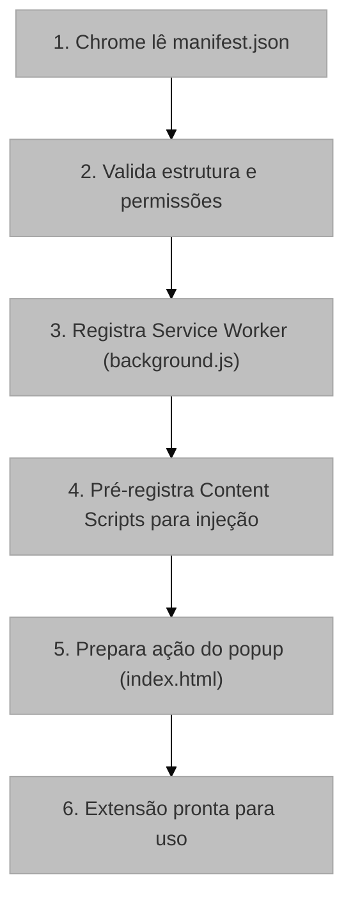

# Manifesto da Extensão (manifest.json)

## 1. Visão Geral e Propósito

O arquivo [`manifest.json`](../manifest.json) constitui o documento de configuração central da extensão Chrome, funcionando como seu "cartão de identidade" e especificando todos os metadados, permissões e componentes que compõem o sistema. Este arquivo é obrigatório para qualquer extensão do Chrome e segue as especificações do Manifest V3, a versão mais recente da plataforma de extensões do Google Chrome.

### 1.1 Integração com o Sistema

O manifesto atua como o ponto de entrada para o navegador, definindo:

- Quais scripts serão executados e em que contexto
- Quais permissões a extensão requer
- Como a interface do usuário será apresentada

## 2. Arquitetura e Lógica

### 2.1 Estrutura do Arquivo

```json
{
  "manifest_version": 3,
  "name": "UX Auditor Extension",
  "version": "2.0",
  "action": { ... },
  "background": { ... },
  "content_scripts": [ ... ],
  "permissions": [ ... ]
}
```

### 2.2 Fluxo de Carregamento

O ciclo de carregamento da extensão segue a seguinte sequência:

**Fluxograma do ciclo de carregamento da extensão a partir da leitura do manifesto pelo navegador.**



## 3. Análise Detalhada dos Campos

### 3.1 Metadados da Extensão

| Campo | Valor | Descrição |
|-------|-------|-----------|
| `manifest_version` | 3 | Versão do manifesto (V3 é a atual) |
| `name` | "UX Auditor Extension" | Nome exibido ao usuário |
| `version` | "2.0" | Versão da extensão (formato semântico) |

### 3.2 Configuração da Ação (Popup)

```json
"action": {
  "default_popup": "index.html",
  "default_title": "Controle de Gravação"
}
```

O campo `action` define o comportamento do ícone da extensão na barra de ferramentas:

- **`default_popup`**: Página HTML que será exibida ao clicar no ícone
- **`default_title`**: Tooltip exibido ao passar o mouse sobre o ícone

### 3.3 Service Worker (Background Script)

```json
"background": {
  "service_worker": "src/scripts/background.js",
  "type": "module"
}
```

A configuração do Service Worker no Manifest V3 difere fundamentalmente do modelo de Background Pages do V2:

| Aspecto | Manifest V2 | Manifest V3 |
|---------|-------------|-------------|
| Modelo | Background Page (persistente) | Service Worker (event-based) |
| Ciclo de vida | Contínuo | Suspenso quando inativo |
| Escopo | Global | Isolado por evento |
| Módulos ES | Não suportado nativamente | Suportado via `"type": "module"` |

**Implicação Arquitetural**: A natureza event-based do Service Worker exige que o estado seja persistido externamente (via `chrome.storage`), pois a memória pode ser perdida entre eventos.

### 3.4 Content Scripts

```json
"content_scripts": [
  {
    "matches": ["<all_urls>"],
    "js": ["src/scripts/content.js"]
  }
]
```

A configuração de Content Scripts define:

- **`matches`**: Padrões de URL onde o script será injetado
  - `"<all_urls>"`: Injeta em todas as páginas HTTP, HTTPS e file://
- **`js`**: Lista de scripts a serem injetados

**Padrão de Injeção**:

$$
\text{Injeção} = \begin{cases}
\text{Automática} & \text{se URL } \in \text{ matches} \\
\text{Manual} & \text{via chrome.scripting.executeScript}
\end{cases}
$$

### 3.5 Permissões

```json
"permissions": [
  "activeTab",
  "scripting",
  "storage",
  "downloads"
]
```

| Permissão | Finalidade | Justificativa |
|-----------|------------|---------------|
| `activeTab` | Acesso temporário à aba ativa | Permite injetar scripts e acessar o DOM da aba atual sem permissões host amplas |
| `scripting` | API chrome.scripting | Necessária para injeção programática de scripts |
| `storage` | API chrome.storage | Persistência de estado e eventos gravados |
| `downloads` | API chrome.downloads | Download do arquivo JSON com a sessão gravada |

#### Princípio de Menor Privilégio

A escolha das permissões segue o princípio de menor privilégio (Principle of Least Privilege):

$$
\text{Privilégio}_{\text{real}} \subseteq \text{Privilégio}_{\text{necessário}}
$$

A permissão `activeTab` é particularmente importante pois fornece acesso à aba atual apenas quando o usuário interage com a extensão, evitando a necessidade da permissão `tabs` que seria mais permissiva.

## 4. Fundamentação Matemática

### 4.1 Modelo de Versionamento Semântico

O campo `version` segue o esquema de versionamento semântico:

$$
\text{version} = \text{MAJOR}.\text{MINOR}.\text{PATCH}
$$

Onde:
- **MAJOR**: Mudanças incompatíveis com versões anteriores
- **MINOR**: Novas funcionalidades compatíveis
- **PATCH**: Correções de bugs compatíveis

### 4.2 Padrões de URL (Match Patterns)

A sintaxe de match patterns segue a especificação:

$$
\text{pattern} = \underbrace{\text{scheme}}_{\text{http|https|file|*}} :// \underbrace{\text{host}}_{\text{*|domain|subdomain.*}} \underbrace{\text{path}}_{\text{/*|/path}}
$$

Para `<all_urls>`, a expansão é:

$$
\text{<all\_urls>} = \bigcup_{s \in \{http, https, file\}} s://*
$$

## 5. Parâmetros Técnicos

### 5.1 Configurações Opcionais Não Utilizadas

| Campo | Status | Justificativa |
|-------|--------|---------------|
| `icons` | Não definido | A extensão utiliza ícone padrão do Chrome |
| `default_icon` | Não definido | Mesma razão acima |
| `host_permissions` | Não definido | `activeTab` é suficiente para o caso de uso |
| `web_accessible_resources` | Não definido | Não há recursos que precisam ser acessíveis via URL |

### 5.2 Impacto das Escolhas de Configuração

| Decisão | Impacto Positivo | Trade-off |
|---------|------------------|-----------|
| `type: "module"` | Suporte a ES Modules | Requer build tool para compatibilidade |
| `<all_urls>` | Cobertura universal | Revisão mais rigorosa na Chrome Web Store |
| Service Worker | Eficiência de recursos | Complexidade de persistência de estado |

## 6. Mapeamento Tecnológico e Referências

### 6.1 Chrome Extensions Manifest V3

**Documentação Oficial**: https://developer.chrome.com/docs/extensions/mv3/intro/

**Citação Recomendada (BibTeX)**:
```bibtex
@online{chrome_extensions_mv3,
  author = {{Chrome Developers}},
  title = {Chrome Extensions Documentation - Manifest V3},
  year = {2024},
  url = {https://developer.chrome.com/docs/extensions/mv3/intro/},
  note = {Acesso em: 2024}
}
```

### 6.2 Service Workers

**Documentação Oficial**: https://developer.chrome.com/docs/extensions/mv3/service_workers/

**Artigo Seminal**:
```bibtex
@inproceedings{service_workers_w3c,
  author = {Nikhil Marathe and Alex Russell},
  title = {Service Workers: High Performance Offline Web Apps},
  booktitle = {W3C Specification},
  year = {2014},
  url = {https://www.w3.org/TR/service-workers/}
}
```

### 6.3 Match Patterns

**Documentação Oficial**: https://developer.chrome.com/docs/extensions/mv3/match_patterns/

### 6.4 Permissões

**Documentação Oficial**: https://developer.chrome.com/docs/extensions/mv3/declare_permissions/

**Princípio de Menor Privilégio**:
```bibtex
@article{saltzer1975protection,
  author = {Saltzer, Jerome H. and Schroeder, Michael D.},
  title = {The Protection of Information in Computer Systems},
  journal = {Proceedings of the IEEE},
  volume = {63},
  number = {9},
  pages = {1278--1308},
  year = {1975},
  doi = {10.1109/PROC.1975.9939}
}
```

## 7. Justificativa de Escolha

### 7.1 Manifest V3 vs Manifest V2

A escolha do Manifest V3 foi motivada por:

1. **Obrigatoriedade**: O Google Chrome descontinuou o suporte ao Manifest V2 em 2024
2. **Segurança**: Service Workers são mais seguros que Background Pages persistentes
3. **Performance**: O modelo event-based consome menos recursos do sistema
4. **Futuro**: Garante compatibilidade com versões futuras do Chrome

### 7.2 Permissão `activeTab` vs `tabs`

A escolha de `activeTab` sobre `tabs` segue o princípio de menor privilégio. Enquanto `tabs` permitiria acesso a todas as abas o tempo todo, `activeTab` concede acesso apenas quando o usuário interage com a extensão, reduzindo a superfície de ataque.

## 8. Considerações para Monografia

### 8.1 Seções Sugeridas

Para a monografia em LaTeX, sugere-se a seguinte estrutura:

```latex
\section{Arquitetura da Extensão}
\subsection{Configuração e Manifesto}
\subsubsection{Estrutura do Manifest V3}
\subsubsection{Modelo de Permissões}
\subsubsection{Service Workers}
```

### 8.2 Figuras Recomendadas

- Diagrama de componentes da extensão
- Fluxograma do ciclo de carregamento
- Tabela comparativa V2 vs V3
