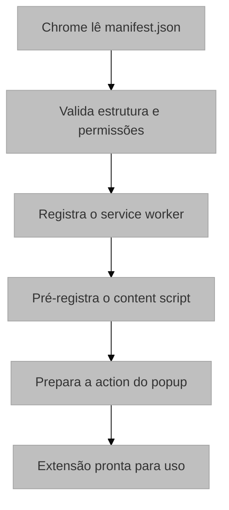

# Manifesto da Extensão (manifest.json)

## 1. Visão Geral e Propósito

O arquivo [`manifest.json`](../manifest.json) constitui o documento de configuração central da extensão Chrome, funcionando como seu "cartão de identidade" e especificando todos os metadados, permissões e componentes que compõem o sistema. Este arquivo é obrigatório para qualquer extensão do Chrome e segue as especificações do Manifest V3, a versão mais recente da plataforma de extensões do Google Chrome. No projeto atual, ele registra o popup, o service worker em modo módulo e o content script injetado em todas as páginas compatíveis.

### 1.1 Integração com o Sistema

O manifesto atua como o ponto de entrada da extensão e informa:

- Quais scripts serão carregados e em qual contexto
- Quais permissões são necessárias
- Qual interface é exibida ao usuário

## 2. Arquitetura e Lógica

### 2.1 Estrutura do Arquivo

```json
{
  "manifest_version": 3,
  "name": "UX Auditor Extension",
  "version": "2.0",
  "action": { ... },
  "background": { ... },
  "content_scripts": [ ... ],
  "permissions": [ ... ]
}
```

### 2.2 Fluxo de Carregamento



## 3. Análise Detalhada dos Campos

### 3.1 Metadados da Extensão

| Campo | Valor | Descrição |
|-------|-------|-----------|
| `manifest_version` | 3 | Versão atual do Manifest V3 |
| `name` | `UX Auditor Extension` | Nome exibido pelo Chrome |
| `version` | `2.0` | Versão funcional da extensão |

### 3.2 Configuração da Ação (Popup)

```json
"action": {
  "default_popup": "index.html",
  "default_title": "Controle de Gravação"
}
```

O campo `action` define o comportamento do ícone da extensão na barra de ferramentas.

### 3.3 Service Worker (Background Script)

```json
"background": {
  "service_worker": "src/scripts/background.js",
  "type": "module"
}
```

O service worker é orientado a eventos e não permanece ativo de forma contínua. Por isso, o estado de gravação e a sessão em andamento são persistidos em `chrome.storage.local`.

### 3.4 Content Scripts

```json
"content_scripts": [
  {
    "matches": ["<all_urls>"],
    "js": ["src/scripts/content.js"]
  }
]
```

O content script é injetado automaticamente nas páginas compatíveis, sem depender de injeção manual por URL específica.

### 3.5 Permissões

```json
"permissions": [
  "activeTab",
  "scripting",
  "storage",
  "downloads"
]
```

| Permissão | Finalidade | Justificativa |
|-----------|------------|---------------|
| `activeTab` | Acesso à aba ativa | Permite atuar na aba corrente sem host permissions amplas |
| `scripting` | API `chrome.scripting` | Necessária para injeção programática de scripts |
| `storage` | API `chrome.storage` | Persistência de estado e sessão |
| `downloads` | API `chrome.downloads` | Geração do arquivo JSON final |

#### Princípio de Menor Privilégio

O manifesto foi desenhado para pedir apenas as permissões estritamente necessárias ao caso de uso.

$$
\text{Privilégio}_{\text{real}} \subseteq \text{Privilégio}_{\text{necessário}}
$$

## 4. Fundamentação Matemática

### 4.1 Modelo de Versionamento Semântico

O campo `version` segue o esquema de versionamento semântico:

$$
\text{version} = \text{MAJOR}.\text{MINOR}.\text{PATCH}
$$

Onde:
- **MAJOR**: Mudanças incompatíveis com versões anteriores
- **MINOR**: Novas funcionalidades compatíveis
- **PATCH**: Correções de bugs compatíveis

### 4.2 Padrões de URL (Match Patterns)

A sintaxe de match patterns segue a especificação:

$$
\text{pattern} = \underbrace{\text{scheme}}_{\text{http|https|file|*}} :// \underbrace{\text{host}}_{\text{*|domain|subdomain.*}} \underbrace{\text{path}}_{\text{/*|/path}}
$$

Para `<all_urls>`, a expansão é:

$$
\text{<all\_urls>} = \bigcup_{s \in \{http, https, file\}} s://*
$$

A cobertura prática é ampla o suficiente para a captura da sessão em páginas HTTP, HTTPS e `file://`.

## 5. Parâmetros Técnicos

### 5.1 Configurações Opcionais Não Utilizadas

| Campo | Status | Justificativa |
|-------|--------|---------------|
| `icons` | Não definido | O projeto não depende de ícone customizado |
| `host_permissions` | Não definido | `activeTab` é suficiente para o fluxo atual |
| `web_accessible_resources` | Não definido | Não há recursos públicos a expor |

### 5.2 Impacto das Escolhas de Configuração

| Decisão | Impacto Positivo | Trade-off |
|---------|------------------|-----------|
| `type: "module"` | ES Modules nativos no service worker | Exige pipeline de build compatível |
| `<all_urls>` | Cobertura ampla | Exige cuidado com a privacidade e revisão |
| `storage` local | Persistência sem backend | Sessões ficam limitadas ao dispositivo |

## 6. Mapeamento Tecnológico e Referências

### 6.1 Chrome Extensions Manifest V3

**Documentação Oficial**: https://developer.chrome.com/docs/extensions/mv3/

**Citação Recomendada (BibTeX)**:
```bibtex
@online{chrome_extensions_mv3,
  author = {{Chrome Developers}},
  title = {Chrome Extensions Documentation - Manifest V3},
  year = {2024},
  url = {https://developer.chrome.com/docs/extensions/mv3/intro/},
  note = {Acesso em: 2024}
}
```

### 6.2 Service Workers

**Documentação Oficial**: https://developer.chrome.com/docs/extensions/mv3/service_workers/

```bibtex
@inproceedings{service_workers_w3c,
  author = {Nikhil Marathe and Alex Russell},
  title = {Service Workers: High Performance Offline Web Apps},
  booktitle = {W3C Specification},
  year = {2014},
  url = {https://www.w3.org/TR/service-workers/}
}
```

### 6.3 Match Patterns

**Documentação Oficial**: https://developer.chrome.com/docs/extensions/mv3/match_patterns/

### 6.4 Permissões

**Documentação Oficial**: https://developer.chrome.com/docs/extensions/mv3/declare_permissions/

```bibtex
@article{saltzer1975protection,
  author = {Saltzer, Jerome H. and Schroeder, Michael D.},
  title = {The Protection of Information in Computer Systems},
  journal = {Proceedings of the IEEE},
  volume = {63},
  number = {9},
  pages = {1278--1308},
  year = {1975},
  doi = {10.1109/PROC.1975.9939}
}
```

## 7. Justificativa de Escolha

### 7.1 Manifest V3 vs Manifest V2

A escolha do Manifest V3 foi motivada por:

1. **Obrigatoriedade**: O Google Chrome descontinuou o suporte ao Manifest V2 em 2024
2. **Segurança**: Service Workers são mais seguros que Background Pages persistentes
3. **Performance**: O modelo event-based consome menos recursos do sistema
4. **Futuro**: Garante compatibilidade com versões futuras do Chrome


## 8. Considerações para Monografia

### 8.1 Seções Sugeridas

```latex
\section{Arquitetura da Extensão}
\subsection{Configuração e Manifesto}
\subsection{Permissões e Princípio de Menor Privilégio}
\subsection{Service Worker e Persistência}
```

### 8.2 Figuras Recomendadas

- Diagrama do ciclo de carregamento
- Tabela de permissões
- Comparativo entre Background Page e Service Worker
