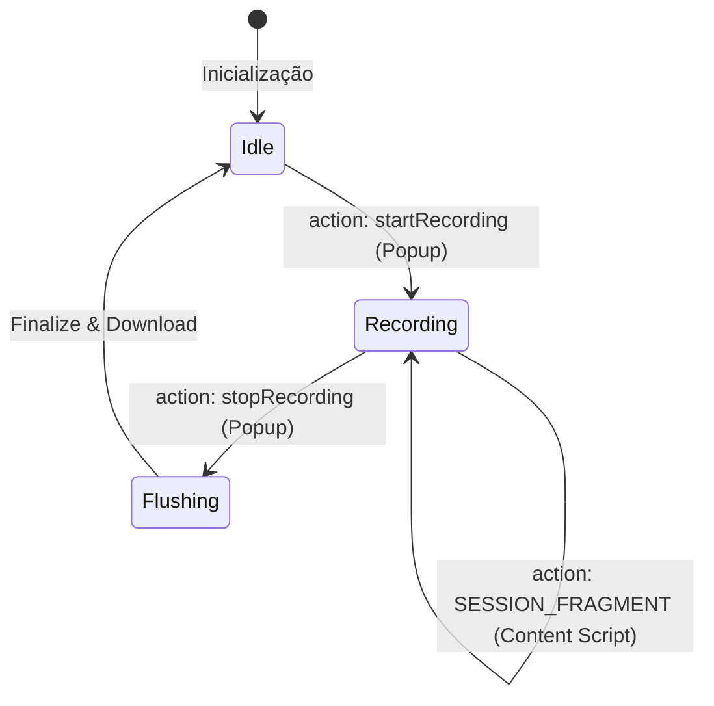

# Service Worker e Gestão de Estado

O **Service Worker (`background.js`)** é o núcleo de persistência e orquestração da extensão. Ele roda de forma assíncrona e desvinculada do ciclo de vida das abas, permitindo que a gravação continue mesmo em recargas de página ou trocas de aba.

## 1. Fluxo de Vida da Sessão

O Service Worker gerencia a transição entre os estados da sessão através de mensagens `chrome.runtime`:

1.  **`startRecording`**: Gera um novo `session_id`, limpa o `chrome.storage.local`, inicia o cronômetro visual (badge) e notifica a aba ativa para injetar o motor `rrweb`.
2.  **`SESSION_FRAGMENT`**: Recebe pedaços da sessão do Content Script e os mescla no rascunho global usando a função `mergeSessionFragment`.
3.  **`stopRecording`**: Solicita um "Flush" final ao Content Script, encerra o cronômetro e dispara o processo de exportação JSON.

---

## 2. Persistência Resiliente com `chrome.storage.local`

Para evitar a perda de dados em caso de fechamento inesperado do navegador ou falha na aba, o Service Worker persiste cada fragmento recebido imediatamente:

-   **Fragmentos Acumulativos**: Cada mensagem `SESSION_FRAGMENT` é concatenada ao rascunho existente.
-   **Recuperação de Crash**: Na inicialização, o script verifica se existe uma gravação em andamento no `storage.local`. Se houver, ele tenta retomar o estado.

---

## 3. Feedback Visual: O Badge Timer

O Service Worker controla o "badge" da extensão (o pequeno texto sobre o ícone):
-   **Cor**: Muda para vermelho (`#FF0000`) ao iniciar a gravação.
-   **Texto**: Atualiza a cada segundo com o formato `MM:SS` do tempo decorrido, garantindo que o pesquisador saiba exatamente quanto tempo de sessão já foi capturado.

---

## 4. Orquestração de Mensagens

O sistema de mensagens é o "sistema nervoso" da extensão:

| Ação | De -> Para | Descrição |
| :--- | :--- | :--- |
| `CHECK_STATUS` | CS -> BG | Content Script verifica se deve iniciar a gravação após recarga. |
| `SESSION_FRAGMENT` | CS -> BG | Envio de dados enriquecidos (métricas, semântica). |
| `BUFFER_EVENTS` | CS -> BG | Envio de eventos brutos do `rrweb`. |
| `FLUSH_DONE` | CS -> BG | Sinaliza que a aba terminou de enviar dados após o comando de parada. |
| `DOWNLOAD_FULL_SESSION` | BG -> CS | Comando final para disparar o download do JSON consolidado. |
