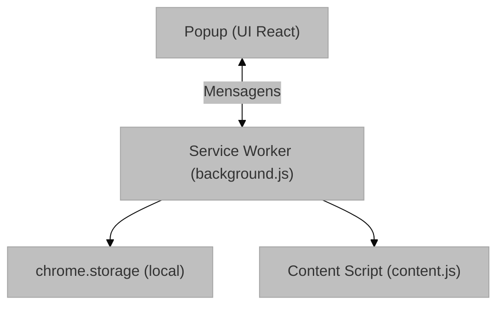
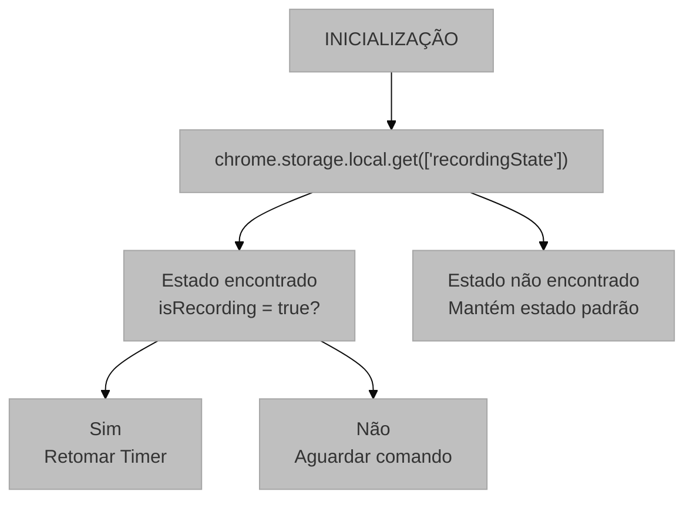
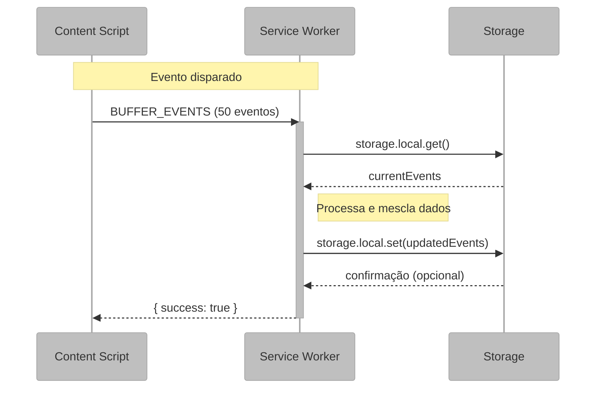
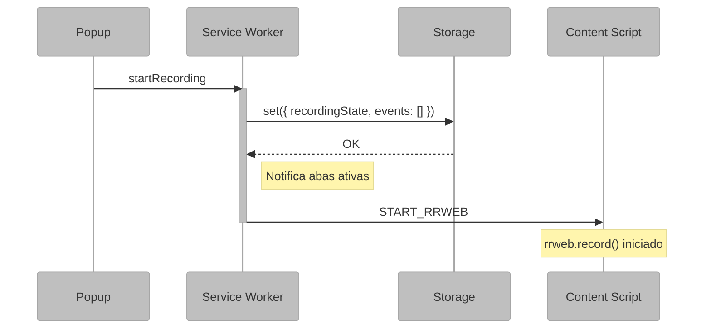

# Service Worker (background.js)

## 1. Visão Geral e Propósito

O arquivo [`background.js`](../src/scripts/background.js) implementa o Service Worker da extensão, funcionando como o orquestrador central do sistema. No contexto do Manifest V3, o Service Worker substitui as tradicionais Background Pages, operando em um modelo orientado a eventos com ciclo de vida gerenciado pelo navegador.

### 1.1 Papel no Sistema

O Service Worker desempenha as seguintes responsabilidades:

1. **Gerenciamento de Estado Global**: Mantém o estado de gravação da sessão
2. **Persistência de Dados**: Armazena eventos capturados no `chrome.storage.local`
3. **Coordenação de Mensagens**: Atua como intermediário entre Popup e Content Script
4. **Interface Visual**: Atualiza o badge do ícone da extensão com o tempo de gravação

### 1.2 Integração com o Sistema

**Diagrama de integração do Service Worker como orquestrador central entre a UI, o armazenamento local e os scripts de conteúdo.**



## 2. Arquitetura e Lógica

### 2.1 Estrutura de Estado

O Service Worker mantém dois estados principais:

```javascript
// Estado da gravação (persistido)
let recordingState = {
  isRecording: false,
  startTime: null
};

// Referência para intervalo do timer (não persistido)
let timerInterval = null;
```

**Modelo de Estado**:

$$
\text{Estado} = \begin{cases}
\text{isRecording} \in \{\text{true}, \text{false}\} \\
\text{startTime} \in \mathbb{Z}^+ \cup \{\text{null}\}
\end{cases}
$$

### 2.2 Fluxo de Inicialização

**Fluxograma da lógica de inicialização e recuperação de estado do Service Worker.**



### 2.3 Sistema de Mensagens

O Service Worker implementa um listener centralizado que processa diferentes tipos de ações:

| Ação | Origem | Descrição |
|------|--------|-----------|
| `CHECK_STATUS` | Content Script | Verifica se há gravação ativa |
| `BUFFER_EVENTS` | Content Script | Recebe lote de eventos capturados |
| `FLUSH_DONE` | Content Script | Sinaliza fim do envio de dados |
| `getStatus` | Popup | Solicita estado atual |
| `startRecording` | Popup | Inicia nova sessão |
| `stopRecording` | Popup | Encerra sessão atual |

### 2.4 Fluxo de Dados Durante Gravação



## 3. Fundamentação Matemática

### 3.1 Cálculo do Tempo Decorrido

O tempo decorrido é calculado pela diferença entre o timestamp atual e o timestamp de início:

$$
\Delta t = t_{\text{atual}} - t_{\text{início}}
$$

A conversão para formato MM:SS segue:

$$
\text{minutos} = \left\lfloor \frac{\Delta t}{60} \right\rfloor
$$

$$
\text{segundos} = \Delta t \mod 60
$$

**Implementação**:

```javascript
const seconds = Math.floor((Date.now() - recordingState.startTime) / 1000);
const m = Math.floor(seconds / 60).toString();
const s = (seconds % 60).toString().padStart(2, '0');
```

### 3.2 Acumulação de Eventos

O processo de acumulação de eventos pode ser modelado como:

$$
E_{\text{total}} = \bigcup_{i=1}^{n} E_i
$$

Onde $E_i$ representa cada lote de eventos recebido do Content Script.

### 3.3 Latência de Comunicação

O tempo total de persistência de um evento é:

$$
T_{\text{persistência}} = T_{\text{captura}} + T_{\text{buffer}} + T_{\text{mensagem}} + T_{\text{storage}}
$$

Onde:
- $T_{\text{captura}}$: Tempo de captura pelo rrweb
- $T_{\text{buffer}}$: Tempo de espera no buffer (até 50 eventos)
- $T_{\text{mensagem}}$: Latência da API de mensagens
- $T_{\text{storage}}$: Latência de escrita no storage

## 4. Parâmetros Técnicos

### 4.1 Configurações do Badge

| Parâmetro | Valor | Descrição |
|-----------|-------|-----------|
| Cor de fundo | `#FF0000` | Vermelho para indicar "REC" |
| Intervalo de atualização | 1000ms | Atualização por segundo |
| Formato | `M:SS` | Minutos e segundos |

### 4.2 Configurações de Storage

| Chave | Tipo | Propósito |
|-------|------|-----------|
| `recordingState` | Object | Estado persistido da gravação |
| `events` | Array | Lista acumulada de eventos rrweb |

### 4.3 Limitações do Service Worker

| Aspecto | Limitação | Solução Adotada |
|---------|-----------|-----------------|
| Ciclo de vida | Pode ser suspenso a qualquer momento | Persistir estado em `chrome.storage` |
| Intervalos | Perdidos ao suspender | Reinicializar timer ao retomar |
| Memória | Volátil | Usar storage para dados críticos |

## 5. Mapeamento Tecnológico e Referências

### 5.1 Chrome Storage API

**Documentação Oficial**: https://developer.chrome.com/docs/extensions/reference/api/storage

**Citação (BibTeX)**:
```bibtex
@online{chrome_storage_api,
  author = {{Chrome Developers}},
  title = {chrome.storage API},
  year = {2024},
  url = {https://developer.chrome.com/docs/extensions/reference/api/storage}
}
```

### 5.2 Chrome Runtime Messaging

**Documentação Oficial**: https://developer.chrome.com/docs/extensions/reference/api/runtime

**Padrão de Mensagens**:
```bibtex
@online{chrome_messaging,
  author = {{Chrome Developers}},
  title = {Message Passing},
  year = {2024},
  url = {https://developer.chrome.com/docs/extensions/mv3/messaging/}
}
```

### 5.3 Chrome Action API (Badge)

**Documentação Oficial**: https://developer.chrome.com/docs/extensions/reference/api/action

### 5.4 Chrome Tabs API

**Documentação Oficial**: https://developer.chrome.com/docs/extensions/reference/api/tabs

### 5.5 Service Worker Architecture

**Especificação W3C**:
```bibtex
@techreport{w3c_service_workers,
  author = {Nikhil Marathe and Alex Russell and Jungkee Song},
  title = {Service Workers Nightly},
  institution = {W3C},
  year = {2024},
  url = {https://w3c.github.io/ServiceWorker/}
}
```

## 6. Análise do Código

### 6.1 Função `startManager()`

**Propósito**: Inicializa uma nova sessão de gravação.

**Sequência de Operações**:

1. Captura timestamp atual: `Date.now()`
2. Define estado de gravação ativo
3. Persiste estado e limpa eventos anteriores
4. Inicia contador visual no badge
5. Notifica Content Script para iniciar captura

**Diagrama de Sequência**:



### 6.2 Função `stopManager()`

**Propósito**: Encerra a sessão de gravação e dispara o processo de download.

**Padrão de Flush**:

O sistema não baixa imediatamente ao receber o comando de parada. Em vez disso, solicita ao Content Script que "esvazie o buffer" (flush) primeiro:

$$
\text{Stop} \rightarrow \text{Flush} \rightarrow \text{Download}
$$

Isso garante que os últimos milissegundos de interação sejam capturados.

### 6.3 Função `triggerDownload()`

**Propósito**: Consolida todos os eventos e envia para o Content Script gerar o arquivo.

**Fluxo**:

```
1. Recupera lista completa de eventos do storage
2. Envia mensagem 'DOWNLOAD_FULL_SESSION' ao Content Script
3. Content Script gera Blob JSON e dispara download
```

### 6.4 Sistema de Badge Timer

O badge timer utiliza `setInterval` para atualização periódica:

```javascript
timerInterval = setInterval(updateBadge, 1000);
```

**Tratamento de Ressuspensão**:

Quando o Service Worker é retomado após suspensão, o timer é reinicializado:

```javascript
if (recordingState.isRecording) {
  startBadgeTimer();
}
```

## 7. Justificativa de Escolhas

### 7.1 Uso de `chrome.storage.local` vs `chrome.storage.sync`

| Aspecto | `local` | `sync` |
|---------|---------|--------|
| Limite de armazenamento | 10 MB | 100 KB |
| Sincronização | Não | Sim |
| Latência | Menor | Maior |

**Decisão**: `chrome.storage.local` foi escolhido pela maior capacidade de armazenamento, essencial para acumular eventos de sessões longas.

### 7.2 Padrão de Mensagens Assíncronas

O uso de `return true` no listener de mensagens permite respostas assíncronas:

```javascript
chrome.runtime.onMessage.addListener((request, sender, sendResponse) => {
  // ...
  return true; // Mantém canal aberto para resposta assíncrona
});
```

Isso é necessário porque operações de storage são assíncronas.

### 7.3 Tamanho do Buffer no Content Script

O Content Script envia eventos em lotes de 50. Essa escolha equilibra:

- **Menor latência**: Lotes menores = envio mais frequente
- **Menor overhead**: Lotes maiores = menos mensagens

$$
\text{Trade-off} = \frac{\text{Latência}}{\text{Overhead de Mensagens}}
$$

## 8. Considerações para Monografia

### 8.1 Seções Sugeridas

```latex
\section{Implementação do Service Worker}
\subsection{Arquitetura Orientada a Eventos}
\subsection{Gerenciamento de Estado Persistente}
\subsection{Sistema de Comunicação entre Componentes}
\subsection{Interface Visual via Badge}
```

### 8.2 Algoritmos para Documentação

- Algoritmo de inicialização com recuperação de estado
- Algoritmo de acumulação de eventos
- Algoritmo de finalização com flush

### 8.3 Métricas de Performance

Sugere-se documentar:

- Tempo médio de persistência de evento
- Capacidade máxima de armazenamento
- Comportamento sob suspensão do Service Worker
