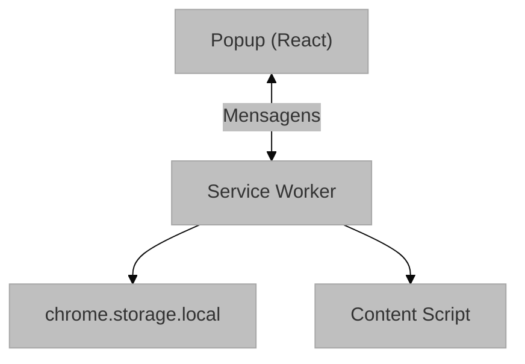
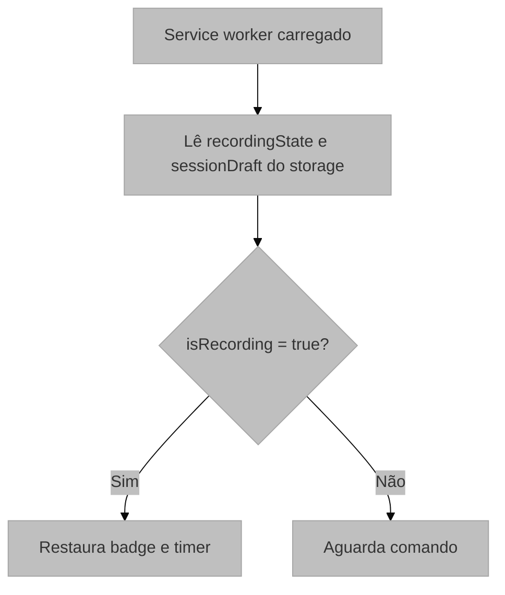
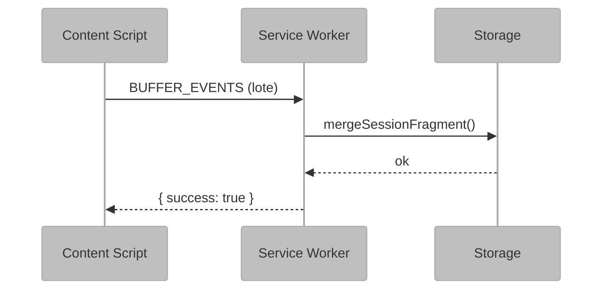

# Service Worker (background.js)

## 1. Visão Geral e Propósito

O arquivo [`background.js`](../src/scripts/background.js) implementa o service worker da extensão e atua como orquestrador da sessão. Ele inicia e encerra gravações, persiste o estado corrente, coordena mensagens entre popup e content script e atualiza o badge de tempo no ícone da extensão.

### 1.1 Papel no Sistema

O service worker é responsável por:

1. Gerenciar `recordingState`
2. Criar e persistir `sessionDraft`
3. Encaminhar mensagens para o content script
4. Controlar o badge de gravação
5. Disparar o fluxo de exportação ao final da sessão

### 1.2 Integração com o Sistema



## 2. Arquitetura e Lógica

### 2.1 Estrutura de Estado

O service worker mantém dois blocos principais de estado:

```javascript
let recordingState = {
  isRecording: false,
  startTime: null,
};

let sessionDraft = createEmptySessionDraft();
```

O primeiro controla se há gravação ativa e quando ela começou. O segundo concentra os fragmentos da sessão já capturados.

Na prática, `sessionDraft` é o objeto que depois vira o JSON exportado. Ele vai recebendo, por merge, blocos como `rrweb.events`, `page_semantics`, `interaction_summary`, `ui_dynamics`, `heuristic_evidence` e `ux_markers`.

### 2.2 Fluxo de Inicialização

Na inicialização, o worker recupera `recordingState` e `sessionDraft` de `chrome.storage.local`. Se a extensão reiniciar durante uma sessão ativa, o badge é reativado a partir do estado persistido.



### 2.3 Sistema de Mensagens

| Ação | Origem | Descrição |
|------|--------|-----------|
| `CHECK_STATUS` | Content Script | Verifica se há gravação em andamento |
| `SESSION_META` | Content Script | Atualiza metadados da sessão |
| `SESSION_FRAGMENT` | Content Script | Mescla fragmentos analíticos da sessão |
| `BUFFER_EVENTS` | Content Script | Recebe lotes de eventos rrweb |
| `FLUSH_DONE` | Content Script | Indica que o flush final terminou |
| `getStatus` | Popup | Solicita o estado visual da gravação |
| `startRecording` | Popup | Inicia uma nova sessão |
| `stopRecording` | Popup | Encerra a sessão atual |

### 2.4 Fluxo de Dados Durante a Gravação



## 3. Fundamentação Matemática

### 3.1 Cálculo do Tempo Decorrido

$$
\Delta t = t_{\text{atual}} - t_{\text{início}}
$$

O badge exibe o tempo em formato `M:SS`, com atualização por segundo.

### 3.2 Acumulação de Eventos

$$
E_{\text{total}} = \bigcup_{i=1}^{n} E_i
$$

Onde cada `E_i` representa um lote recebido do content script.

### 3.3 Latência de Comunicação

$$
T_{\text{persistência}} = T_{\text{captura}} + T_{\text{buffer}} + T_{\text{mensagem}} + T_{\text{storage}}
$$

## 4. Parâmetros Técnicos

### 4.1 Configurações do Badge

| Parâmetro | Valor | Descrição |
|-----------|-------|-----------|
| Cor de fundo | `#FF0000` | Sinal visual de gravação ativa |
| Intervalo | 1000ms | Atualização por segundo |
| Formato | `M:SS` | Tempo decorrido |

### 4.2 Configurações de Storage

| Chave | Tipo | Propósito |
|-------|------|-----------|
| `recordingState` | Object | Estado persistido da gravação |
| `sessionDraft` | Object | Sessão em construção com blocos de replay, semântica e heurísticas |

### 4.3 Limitações do Service Worker

| Aspecto | Limitação | Solução Adotada |
|---------|-----------|-----------------|
| Ciclo de vida | Pode ser suspenso | Persistir estado em storage |
| Intervalos | São descartados ao suspender | Recriar o timer ao retomar |
| Memória | Volátil | Guardar dados críticos em `chrome.storage.local` |

## 5. Mapeamento Tecnológico e Referências

### 5.1 Chrome Storage API

**Documentação Oficial**: https://developer.chrome.com/docs/extensions/reference/api/storage

```bibtex
@online{chrome_storage_api,
  author = {{Chrome Developers}},
  title = {chrome.storage API},
  year = {2024},
  url = {https://developer.chrome.com/docs/extensions/reference/api/storage}
}
```

### 5.2 Chrome Runtime Messaging

**Documentação Oficial**: https://developer.chrome.com/docs/extensions/reference/api/runtime

```bibtex
@online{chrome_messaging,
  author = {{Chrome Developers}},
  title = {Message Passing},
  year = {2024},
  url = {https://developer.chrome.com/docs/extensions/mv3/messaging/}
}
```

### 5.3 Chrome Action API

**Documentação Oficial**: https://developer.chrome.com/docs/extensions/reference/api/action

### 5.4 Chrome Tabs API

**Documentação Oficial**: https://developer.chrome.com/docs/extensions/reference/api/tabs

### 5.5 Service Worker Architecture

```bibtex
@techreport{w3c_service_workers,
  author = {Nikhil Marathe and Alex Russell and Jungkee Song},
  title = {Service Workers Nightly},
  institution = {W3C},
  year = {2024},
  url = {https://w3c.github.io/ServiceWorker/}
}
```

## 6. Análise do Código

### 6.1 Função `startManager()`

`startManager()` cria uma nova sessão, define `isRecording = true`, inicializa `sessionDraft`, persiste o estado e envia `START_RRWEB` para a aba ativa.

### 6.2 Função `stopManager()`

`stopManager()` encerra o badge, marca `ended_at` na sessão, grava o estado final e envia `STOP_AND_FLUSH` ao content script.

### 6.3 Função `triggerDownload()`

Após o `FLUSH_DONE`, o service worker lê `sessionDraft` do storage e encaminha `DOWNLOAD_FULL_SESSION` ao content script para gerar o arquivo JSON.

### 6.4 Sistema de Badge Timer

O badge é atualizado com `setInterval(updateBadge, 1000)`. Se o worker for restaurado durante uma gravação ativa, o timer é recriado a partir do `recordingState`.

## 7. Justificativa de Escolhas

### 7.1 `chrome.storage.local` vs `chrome.storage.sync`

| Aspecto | `local` | `sync` |
|---------|---------|--------|
| Capacidade | Maior | Menor |
| Sincronização | Não | Sim |
| Latência | Menor | Maior |

### 7.2 Padrão de Mensagens Assíncronas

O listener retorna `true` quando precisa manter o canal aberto para respostas assíncronas, porque a persistência da sessão depende de operações de storage.

### 7.3 Tamanho do Buffer no Content Script

O limite de 50 eventos equilibra latência de envio e sobrecarga de mensagens entre content script e service worker.

## 8. Considerações para Monografia

### 8.1 Seções Sugeridas

```latex
\section{Implementação do Service Worker}
\subsection{Arquitetura Orientada a Eventos}
\subsection{Gerenciamento de Estado Persistente}
\subsection{Comunicação entre Componentes}
\subsection{Interface Visual via Badge}
```

### 8.2 Algoritmos para Documentação

- Inicialização com recuperação de estado
- Acumulação de eventos por lote
- Finalização com flush e exportação

### 8.3 Métricas de Performance

- Tempo médio de persistência
- Capacidade de sessão por armazenamento local
- Comportamento sob suspensão do service worker
