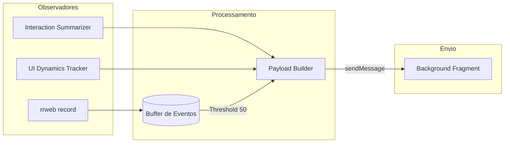

# Content Script e Pipeline de Captura

O **Content Script (`content.js`)** é o motor de execução que roda no contexto da página. Ele é responsável por orquestrar a coleta de dados, aplicar o enriquecimento semântico e derivar evidências comportamentais em tempo real.

## 1. O Pipeline de Captura de Dados

O processo segue um fluxo cíclico de captura, bufferização e envio ("flush"):

### Principais Estágios:
1.  **Captura (`rrweb`)**: Registra todos os eventos do DOM (mutações, mouse, scroll) com alta fidelidade visual.
2.  **Enriquecimento (`InteractionSummarizer`)**: Converte eventos brutos em métricas de alto nível (ex: transformando 50 coordenadas de mouse em um "Caminho do Ponteiro" com velocidade média).
3.  **Bufferização**: Os eventos brutos são acumulados em um array.
4.  **Flush**: Ocorre quando o buffer atinge 50 eventos ou após 1.2 segundos de inatividade, garantindo que o Background sempre tenha os dados mais recentes.

---

## 2. Checkpoints Analíticos

Diferente do fluxo contínuo, os checkpoints são momentos em que o script "para e pensa", realizando uma varredura completa do estado da aplicação:

| Trigger | Ações Executadas | Justificativa |
| :--- | :--- | :--- |
| `session_start` | `collectPageSemantics`, `runAxe` | Estabelecer o contexto inicial da página e acessibilidade. |
| `form_submit` | `collectPageSemantics`, `runAxe`, `deriveHeuristic` | Capturar o estado final dos dados antes do envio e validar conformidade. |
| `route_change` | `collectPageSemantics`, `runAxe` | Detectar mudanças de "estado" em aplicações SPA (React/Vue/Angular). |

---

## 3. Gestão de Navegação e Perda de Dados

Para garantir que nenhum dado seja perdido durante mudanças de página, o Content Script implementa três estratégias de salvaguarda:

1.  **`beforeunload`**: Dispara um "flush" síncrono e finaliza o estado da sessão no exato momento em que o usuário sai da página.
2.  **`visibilitychange`**: Quando o usuário minimiza o navegador ou troca de aba, o script envia imediatamente os dados pendentes.
3.  **Patches de Histórico**: Sobrescreve `history.pushState` e `history.replaceState` para detectar mudanças de rota sem recarga de página (Single Page Applications).

---

## 4. Integração com Heurísticas e Semântica

O Content Script atua como o ponto de encontro entre os dados brutos e as ferramentas de análise:
-   Utiliza o `SemanticResolver` para obter o "quem" (seletores CSS, labels, papéis ARIA).
-   Utiliza o `HeuristicAggregator` para consolidar evidências e gerar avisos de fricção (ex: detectar que o usuário clicou 5 vezes seguidas no mesmo botão sem resposta).
