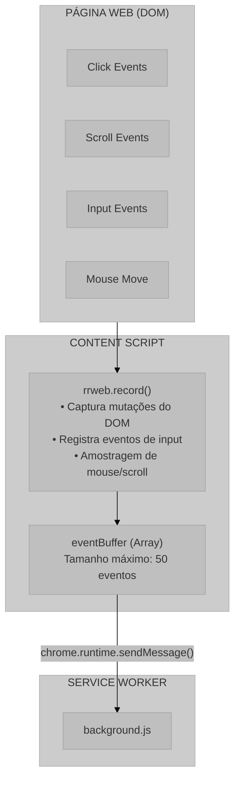
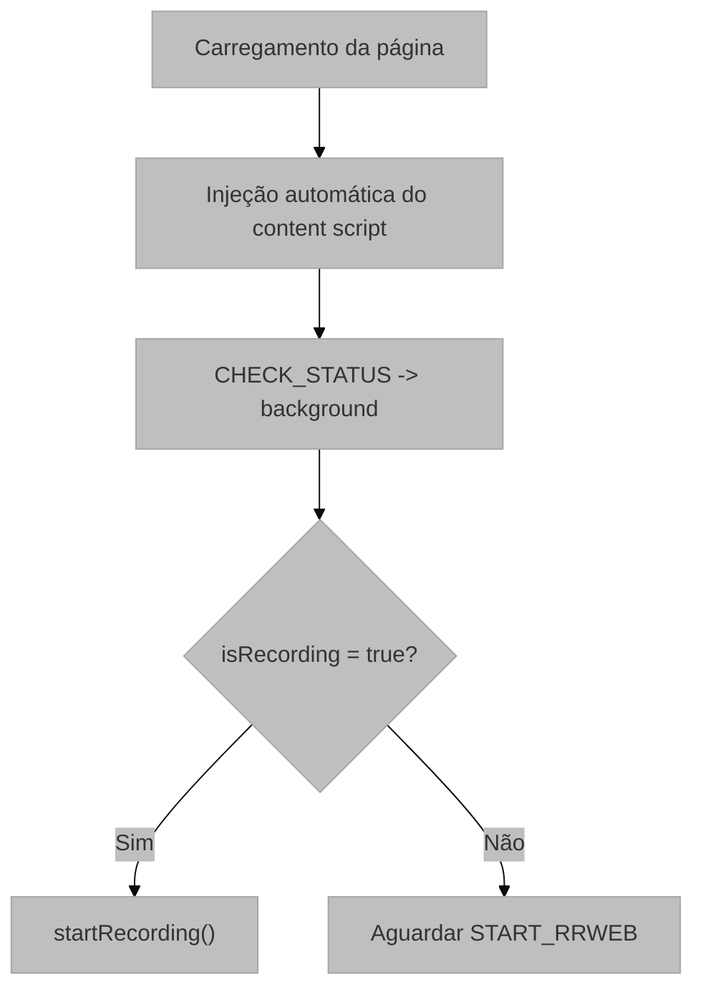
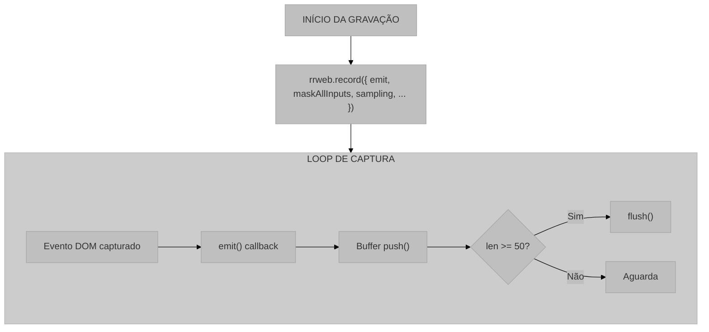

# Content Script (content.js)

## 1. Visão Geral e Propósito

O arquivo [`content.js`](../src/scripts/content.js) implementa o Content Script da extensão, responsável pela captura de eventos de interação do usuário diretamente no contexto da página web. Este componente é injetado automaticamente em todas as páginas navegadas pelo usuário e utiliza a biblioteca **rrweb** para realizar a gravação da sessão.

### 1.1 Papel no Sistema

O content script desempenha as seguintes responsabilidades:

1. **Captura de Eventos DOM**: registra as interações do usuário com a página
2. **Bufferização Local**: acumula eventos antes de enviar ao Service Worker
3. **Gerenciamento do Ciclo de Gravação**: controla início e fim da captura
4. **Exportação de Dados**: gera o arquivo JSON final com a sessão completa
5. **Análise Semântica**: coleta metadados de elementos interativos, landmarks e feedback visual
6. **Heurísticas de Campo**: registra perfis de valor e inconsistências de formato

### 1.2 Integração com o Sistema



## 2. Arquitetura e Lógica

### 2.1 Estrutura de Estado

```javascript
let stopFn = null;
let eventBuffer = [];
let pendingFragment = createEmptySessionDraft();
let sessionDraft = createEmptySessionDraft();
let latestSemantics = null;
```

O estado mantém:

- a função de parada retornada pelo `rrweb`
- o buffer de eventos
- o rascunho da sessão em construção
- a última semântica capturada

Essas estruturas permitem separar captura bruta, checkpoints analíticos e exportação final sem exigir armazenamento em servidor.

### 2.2 Ciclo de Vida do Content Script

O content script é injetado automaticamente em `<all_urls>`. Ao carregar a página, ele consulta `CHECK_STATUS`; se a gravação já estiver ativa, inicia a captura imediatamente.



### 2.3 Sistema de Mensagens

| Ação Recebida | Origem | Resposta |
|---------------|--------|----------|
| `START_RRWEB` | Background | Inicia gravação |
| `STOP_AND_FLUSH` | Background | Para gravação e esvazia buffer |
| `DOWNLOAD_FULL_SESSION` | Background | Gera o arquivo JSON final |
| `SESSION_META` | Background/Content | Atualiza metadados da sessão |

| Ação Enviada | Destino | Condição |
|--------------|---------|----------|
| `CHECK_STATUS` | Background | Ao carregar a página |
| `BUFFER_EVENTS` | Background | Buffer com 50 eventos |
| `SESSION_META` | Background | Ao criar a sessão |
| `SESSION_FRAGMENT` | Background | Ao consolidar checkpoints |
| `FLUSH_DONE` | Background | Após o flush final |

Esse arranjo permite que a sessão sobreviva a reinicializações do service worker e que a página seja analisada mesmo quando a gravação já estava em andamento antes da injeção do script.

### 2.4 Fluxo de Captura de Eventos



## 3. Fundamentação Matemática

### 3.1 Modelo de Captura do rrweb

O rrweb utiliza uma abordagem baseada em **snapshots incrementais** para registrar o estado da página. O modelo pode ser representado como:

$$
S_t = S_0 + \sum_{i=1}^{n} \Delta_i
$$

Onde:
- $S_t$ = Estado da página no tempo $t$
- $S_0$ = Snapshot inicial (DOM completo)
- $\Delta_i$ = Mudança incremental $i$

### 3.2 Amostragem de Eventos

A configuração de amostragem define a frequência de captura para eventos de alta frequência:

$$
f_{\text{scroll}} = \frac{1000}{150} \approx 6.67 \text{ amostras/segundo}
$$

$$
f_{\text{mouse}} = \frac{1000}{100} = 10 \text{ amostras/segundo}
$$

### 3.3 Checkout (Snapshot Periódico)

O parâmetro `checkoutEveryNth: 500` cria snapshots completos com menor frequência, reduzindo o custo de armazenamento e mantendo o replay viável.

**Justificativa**: snapshots periódicos permitem "seek" eficiente no player, sem precisar reproduzir todos os eventos desde o início.

### 3.4 Tamanho do Buffer

$$
\text{Latência}_{\text{max}} = 50 \times T_{\text{evento médio}}
$$

## 4. Parâmetros Técnicos

### 4.1 Configuração do rrweb

| Parâmetro | Valor | Descrição |
|-----------|-------|-----------|
| `maskAllInputs` | `false` | Não mascara todos os inputs de forma genérica |
| `maskInputFn` | Função customizada | Mascara apenas campos sensíveis detectados por contexto |
| `maskInputOptions.password` | `true` | Mascara senhas por padrão |
| `sampling.scroll` | `150` | Amostragem de scroll em milissegundos |
| `sampling.mousemove` | `100` | Amostragem de mouse em milissegundos |
| `checkoutEveryNth` | `500` | Frequência de snapshots completos |

O valor `maskAllInputs: false` é deliberado: o projeto prefere mascaramento seletivo e perfis estruturados de valor a uma obliteração total dos campos.

### 4.2 Configurações de Buffer

| Parâmetro | Valor | Descrição |
|-----------|-------|-----------|
| Tamanho máximo | 50 eventos | Limite para envio ao background |
| Estratégia | Batch | Agrupamento de eventos |

### 4.3 Formato de Saída

O arquivo JSON gerado não contém apenas os eventos rrweb. Ele é um rascunho consolidado da sessão, composto por blocos que o `content.js` vai preenchendo ao longo da gravação e que são serializados no final como um objeto único.

Os principais blocos do payload são:

| Bloco | O que contém | Como é produzido |
|------|--------------|------------------|
| `session_meta` | `session_id`, `started_at`, `ended_at`, URL, título e `user_agent` | Inicializado no `startRecording()` e finalizado no encerramento da sessão |
| `privacy` | Modo de mascaramento e regras de sensibilidade aplicadas | Definido pelo `session-schema` e usado como metadado da coleta |
| `capture_config` | Parâmetros de rrweb e observadores locais | Importado de `createCaptureConfig()` |
| `rrweb.events` | Eventos de replay da página | Acumulados em buffer e enviados em lotes de 50 |
| `axe_preliminary_analysis.runs` | Resumo e violações da análise de acessibilidade | Produzido por `runAxePreliminaryAnalysis()` em checkpoints |
| `page_semantics` | Landmarks, elementos interativos e grupos de formulário | Produzido por `collectPageSemantics(document)` |
| `interaction_summary` | Perfis de movimento, digitação, foco, rolagem e heurísticas de interação | Produzido pelo `InteractionSummarizer` |
| `ui_dynamics` | Janelas de mutação, possíveis shifts e feedback visual | Produzido pelo `UiDynamicsTracker` |
| `heuristic_evidence` | Sinais de acessibilidade e usabilidade extraídos de checkpoints | Produzido por `deriveHeuristicEvidence()` e `deriveBehavioralEvidence()` |
| `ux_markers` | Marcadores pontuais de UX | Gerados por `emitMarker()` e agregados na finalização |

Em termos de estrutura, o JSON final tem formato de objeto, com os blocos acima como propriedades aninhadas. O trecho abaixo é uma simplificação da forma final:

```json
{
  "session_meta": {
    "session_id": "...",
    "started_at": 123,
    "ended_at": 456
  },
  "privacy": {
    "masking_mode": "selective"
  },
  "capture_config": {
    "rrweb": { ... }
  },
  "rrweb": {
    "events": [ ... ]
  },
  "page_semantics": {
    "interactive_elements": [ ... ]
  },
  "interaction_summary": {
    "typing_metrics_by_element": [ ... ],
    "heuristic_candidates": [ ... ]
  },
  "ui_dynamics": {
    "mutation_windows": [ ... ]
  },
  "heuristic_evidence": {
    "accessibility": [ ... ],
    "usability": [ ... ]
  },
  "ux_markers": [ ... ]
}
```

Os eventos rrweb continuam presentes e seguem a semântica habitual do pacote, mas agora estão contextualizados por metadados de sessão, semântica da página e evidências heurísticas.

## 5. Mapeamento Tecnológico e Referências

### 5.1 rrweb

**Documentação Oficial**: https://www.rrweb.io/

```bibtex
@misc{rrweb2019,
  author = {{rrweb Team}},
  title = {rrweb: Record and Replay the Web},
  year = {2019},
  publisher = {GitHub},
  url = {https://github.com/rrweb-io/rrweb}
}
```

### 5.2 MutationObserver API

O rrweb e os analisadores complementares dependem de observadores do DOM para detectar mudanças na página.

**Documentação MDN**: https://developer.mozilla.org/en-US/docs/Web/API/MutationObserver

**Especificação W3C**:
```bibtex
@techreport{w3c_dom4,
  author = {W3C},
  title = {DOM Standard},
  institution = {W3C},
  year = {2024},
  url = {https://dom.spec.whatwg.org/}
}
```

### 5.3 Blob API

Utilizada na geração do arquivo de download.

**Documentação MDN**: https://developer.mozilla.org/en-US/docs/Web/API/Blob

### 5.4 URL.createObjectURL

**Documentação MDN**: https://developer.mozilla.org/en-US/docs/Web/API/URL/createObjectURL_static

## 6. Análise do Código

### 6.1 Função `startRecording()`

`startRecording()` inicializa a sessão, cria o `sessionDraft`, envia os metadados iniciais ao background e inicia:

- `rrweb.record()`
- `InteractionSummarizer`
- `UiDynamicsTracker`
- observadores de página

**Configurações de Privacidade**:

```javascript
maskAllInputs: false
```

Esta configuração garante que os campos não sejam universalmente mascarados, permitindo que a análise posterior capture sinais de formato e inconsistência.

### 6.2 Função `flushBuffer()`

Quando o buffer atinge 50 eventos, o content script envia `BUFFER_EVENTS` ao background e limpa o array local.

**Algoritmo**:

```
1. Verificar se buffer está vazio
   1.1. Se vazio, executar callback (se existir) e retornar
2. Enviar mensagem BUFFER_EVENTS ao Background
3. Limpar buffer local
4. Executar callback após confirmação
```

### 6.3 Função `captureCheckpoint()`

Os checkpoints reconstroem a sessão em fragmentos menores, anexando:

- semântica da interface
- métricas de interação
- sinais de acessibilidade
- dinâmica visual da página

Esse checkpoint é a peça que torna o JSON explicativo: a cada ciclo ele captura o estado observável do DOM e agrega evidências derivadas do snapshot atual. Em outras palavras, o arquivo final não é só um replay; ele carrega interpretação local da interface.

### 6.4 Função `saveData()`

`saveData()` transforma o payload consolidado em `Blob`, cria uma URL temporária e dispara o download local do JSON final.

**Processo de Geração de Arquivo**:

```javascript
const blob = new Blob([JSON.stringify(session, null, 2)], { type: 'application/json' });
const url = URL.createObjectURL(blob);
```

**Nome do Arquivo**:

$$
\text{filename} = \text{ux-session-} + t_{\text{timestamp}} + \text{.json}
$$

### 6.5 Perfis de Valor e Formato

Durante a interação com campos de formulário, o summarizer registra:

- `observed_value_profile`
- `observed_value_summary`
- `format_hint`

Na finalização da sessão, o content script emite candidaturas explícitas como `field_input_profile` e `field_format_mismatch` quando o valor observado não respeita a forma esperada pelo contexto semântico.

Esse mecanismo é agnóstico ao conteúdo: ele não nomeia telefone, CPF ou CEP, mas observa comprimento, presença de dígitos, letras, separadores e consistência com a forma detectada na interface.

#### 6.5.1 O que é processado no perfil de campo

Para cada campo com entrada observada, o código processa:

| Campo derivado | Significado |
|---------------|-------------|
| `raw_length` | comprimento bruto do valor |
| `digit_count` | quantidade de dígitos |
| `letter_count` | quantidade de letras |
| `whitespace_count` | quantidade de espaços |
| `separator_count` | quantidade de separadores/símbolos |
| `has_formatting_characters` | indica se há hífens, barras, parênteses, pontos ou outros caracteres de formatação |
| `shape` | assinatura simplificada com `D`, `L`, `S` e `P` |
| `pattern_shape` | formato bruto do valor com dígitos substituídos por `D` |
| `value_kind` | classe semântica do conteúdo (`numeric_only`, `formatted_numeric`, etc.) |
| `has_digits` / `has_letters` | indicadores booleanos de composição |

Quando a interface fornece indícios de formato, o sistema também infere:

| Campo derivado | Significado |
|---------------|-------------|
| `expected_shape` | formato esperado a partir de placeholder/padrão |
| `expected_digit_count` | quantidade prevista de dígitos |
| `expected_digit_groups` | grupos numéricos observados no placeholder |
| `pattern_attributes` | `type`, `autocomplete`, `inputMode` e `pattern` usados como pistas |

Na saída final isso vira `field_input_profile` e, quando necessário, `field_format_mismatch`.

#### 6.5.2 Como a verificação de formato é feita

O algoritmo compara o valor observado com o sinal de formato inferido pela interface:

1. Extrai a assinatura do valor digitado.
2. Extrai pistas do DOM, principalmente `placeholder` e atributos de formato.
3. Compara a quantidade de dígitos e a forma geral do texto.
4. Se a forma esperada inclui separadores e o valor não os contém, marca a inconsistência.

Isso permite detectar, por exemplo, um campo numérico digitado como sequência crua, mesmo sem nomeá-lo como telefone, CPF, CNPJ ou CEP.

### 6.6 Lista de Heurísticas Utilizadas

As heurísticas são agrupadas em quatro blocos: interação, formulário, semântica e evidência visual.

#### 6.6.1 Heurísticas de Interação de Ponteiro

| Heurística | Nome no JSON | O que detecta | Evidência principal |
|------------|--------------|---------------|---------------------|
| Permanência prolongada sobre alvo interativo | `hover_prolonged_candidate` | Cursor parado tempo suficiente sobre um elemento interativo | duração do hover, spread do movimento e posição média |
| Burst de busca visual | `visual_search_burst_candidate` | Movimento de ponteiro longo e com pouca ação | duração, densidade de movimento, área percorrida |
| Movimento errático | `erratic_motion_candidate` | Trajeto zigue-zague ou pouco eficiente | eficiência do caminho, mudanças de direção, variância angular |
| Sequência curta de cliques repetidos | `rage_click_candidate` | Cliques repetidos em janela curta de tempo | número de cliques e janela temporal |
| Clique morto | `dead_click_candidate` | Clique em elemento sem resposta aparente | contexto do alvo e ausência de feedback |

#### 6.6.2 Heurísticas de Formulário

| Heurística | Nome no JSON | O que detecta | Evidência principal |
|------------|--------------|---------------|---------------------|
| Hesitação local | `local_hesitation_candidate` | Lacunas longas entre interações em um campo | intervalo entre eventos e tipo anterior |
| Revisão de entrada | `input_revision_candidate` | Campo digitado mais de uma vez ou editado com frequência | contagem de revisões, inserções, deleções e tempo total |
| Campo abandonado | `field_abandonment` | Campo com entrada iniciada e depois abandonada | foco/blur, revisão e estado do campo |
| Perfil de valor do campo | `field_input_profile` | Assinatura do valor digitado | comprimento, dígitos, letras, separadores e classe de valor |
| Inconsistência de formato | `field_format_mismatch` | Valor final não compatível com a forma esperada | `pattern_shape`, `expected_shape` e ausência de separadores |

#### 6.6.3 Heurísticas de Toggle

| Heurística | Nome no JSON | O que detecta | Evidência principal |
|------------|--------------|---------------|---------------------|
| Alternância repetida | `repeated_toggle_candidate` | Checkbox/radio alterado repetidas vezes | sequência de estados e contagem de toggles |

#### 6.6.4 Heurísticas de Estrutura e Semântica

| Heurística | Nome no JSON | O que detecta | Evidência principal |
|------------|--------------|---------------|---------------------|
| Landmarks ausentes | `missing_landmarks` | Página sem landmarks visíveis | contagem de landmarks observados |
| Campos dependentes de placeholder | `placeholder_dependent_fields` | Campo sem label/accessible name e com placeholder como única pista | seletores e contagem de campos |
| Alvo interativo pequeno | `small_click_target` | Elemento abaixo do tamanho recomendado | bounding box e seletores |
| Salto de foco fora de ordem | `out_of_order_focus` | Navegação visualmente fora da ordem esperada | ordem visual aproximada |
| Explosão estrutural | `structural_burst` | Mudança grande de DOM em uma janela curta | quantidade de nós adicionados/removidos |
| Aparição de feedback | `feedback_appearance` | Toast, modal, alert ou outra resposta visual | tipo do feedback detectado |

#### 6.6.5 Marcadores de UX

| Marcador | Quando aparece | Uso |
|----------|---------------|-----|
| `sensitive_input_observed` | Campo sensível reconhecido durante digitação | registrar presença de entrada sensível sem expor o valor |
| `form_validation_error` | Validação de formulário detectada | contextualizar feedback de erro |
| `form_submit_attempt` | Submissão de formulário observada | marcar intenção de envio |
| `spa_route_change` | Mudança de rota SPA | registrar transição sem recarregar a página |
| `modal_open` | Modal observado | sinalizar mudança de estado da interface |
| `toast_visible` | Toast observado | sinalizar feedback temporário |
| `alert_visible` | Alert observado | sinalizar feedback de erro/atenção |

#### 6.6.6 Heurísticas de Acessibilidade e Usabilidade dos Checkpoints

| Heurística | Nome no JSON | O que detecta | Evidência principal |
|------------|--------------|---------------|---------------------|
| Marcos estruturais ausentes | `missing_landmarks` | Falta de landmarks na página | total de landmarks |
| Campos baseados só em placeholder | `placeholder_dependent_fields` | Formulário sem label/accessible name | seletores dos campos |
| Alvos pequenos | `small_click_target` | Alvos menores que 44 px | dimensões do bounding box |
| Burst de mutação | `structural_burst` | Reestruturação intensa da interface | número de nós alterados |
| Análise preliminar de acessibilidade | `axe_preliminary_analysis` | Violações e incompletudes de acessibilidade | resumo, violações e caminhos de nó |

### 6.7 Como os blocos são produzidos

O processamento ocorre em camadas:

1. O rrweb coleta os eventos brutos.
2. O `InteractionSummarizer` transforma eventos de pointer/input/focus/scroll em métricas e candidatos heurísticos.
3. O `UiDynamicsTracker` observa mutações e feedback visual.
4. O checkpoint de semântica recolhe landmarks, elementos interativos e grupos de formulário.
5. O `axe-core` produz um raio-x preliminar de acessibilidade.
6. No encerramento, o `content.js` cruza a semântica com os perfis de valor para gerar `field_input_profile` e `field_format_mismatch`.
7. O payload consolidado é mesclado e exportado como JSON único.

## 7. Justificativa de Escolhas

### 7.1 rrweb vs Soluções Alternativas

| Solução | Vantagens | Desvantagens |
|---------|-----------|--------------|
| rrweb | Open source, alta fidelidade, sem backend | Payload grande |
| FullStory | Recursos analíticos avançados | Pago, dependente de nuvem |
| LogRocket | Integração ampla | Pago, infraestrutura externa |
| Customizada | Controle total | Maior esforço de manutenção |

**Decisão**: rrweb foi escolhido por ser open source, não requerer infraestrutura de servidor e oferecer alta fidelidade na reprodução.

### 7.2 Amostragem de Scroll e Mouse

As taxas atuais reduzem volume sem comprometer a utilidade cinemática da sessão.

#### 7.2.1 Amostragem de Scroll (150ms)

1. A percepção humana tolera amostragem abaixo do frame rate
2. Scroll gera volume alto de eventos
3. 150ms captura intenção sem sobrecarregar o sistema

#### 7.2.2 Amostragem de Mouse (50ms)

1. 20 FPS é suficiente para visualização da trajetória
2. Reduz significativamente o volume de dados
3. É suficiente para análises visuais e heurísticas

### 7.3 Tamanho do Buffer

O buffer de 50 eventos reduz overhead de mensagens sem deixar a latência de gravação excessiva.

O buffer equilibra:

- latência de envio
- performance de comunicação
- confiabilidade em caso de suspensão

## 8. Considerações de Privacidade

### 8.1 Mascaramento Seletivo

O projeto não usa uma máscara uniforme em todos os inputs. Em vez disso, aplica:

- máscara obrigatória para senha
- heurísticas de sensibilidade para email, telefone, cartão e documentos
- perfis estruturados para campos interativos analisados ao final da sessão

### 8.2 Dados Não Capturados

Por padrão, o rrweb não captura com fidelidade total:

- conteúdo de iframes de origens diferentes (CORS)
- conteúdo de elementos `<canvas>`
- mídia de elementos `<video>` e `<audio>`

## 9. Considerações para Monografia

### 9.1 Seções Sugeridas

```latex
\section{Captura de Eventos de Interação}
\subsection{Arquitetura do Content Script}
\subsection{Biblioteca rrweb}
\subsubsection{Modelo de Snapshots Incrementais}
\subsubsection{Configuração de Amostragem}
\subsection{Bufferização e Comunicação}
\subsection{Semântica e Heurísticas de Formato}
\subsection{Geração de Arquivo de Sessão}
\subsection{Considerações de Privacidade}
```

### 9.2 Algoritmos para Documentação

- Captura com rrweb e bufferização por lote
- Consolidação de checkpoints semânticos
- Finalização com perfis de valor e detecção de formato

### 9.3 Métricas Sugeridas

- Taxa de compressão de eventos
- Latência de captura
- Tamanho médio de arquivo por minuto
- Número de campos com `field_input_profile`
