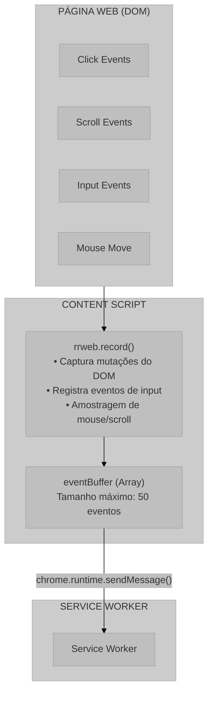
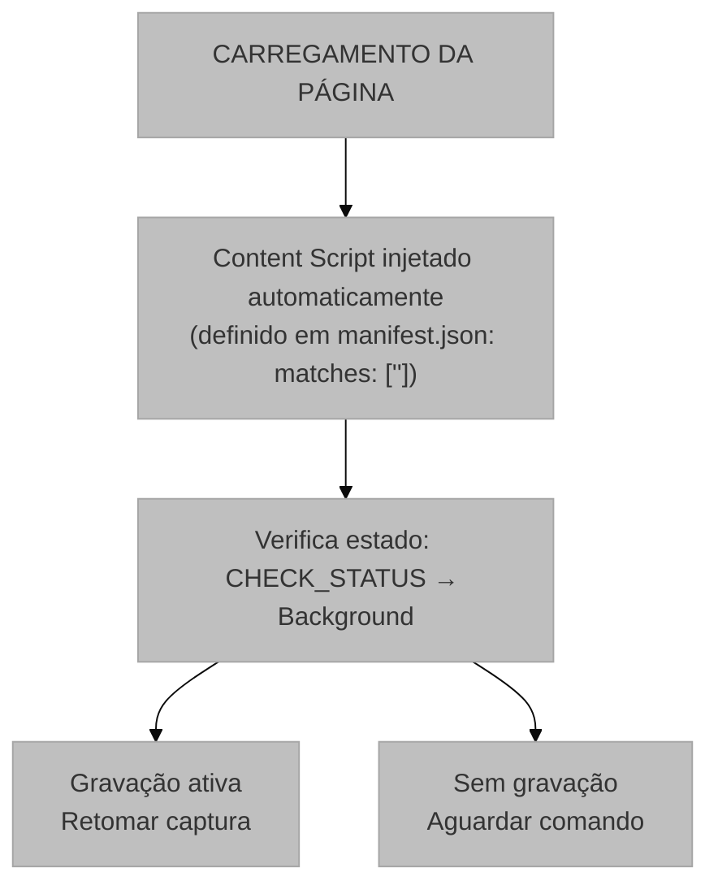
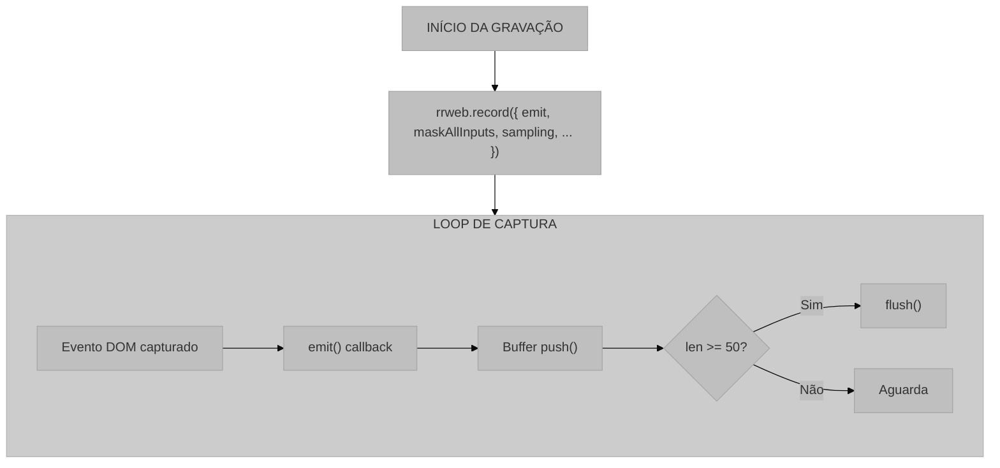
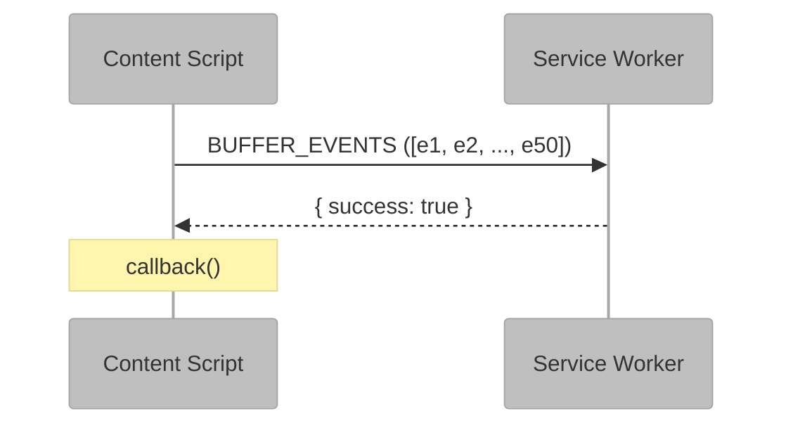

# Content Script (content.js)

## 1. Visão Geral e Propósito

O arquivo [`content.js`](../src/scripts/content.js) implementa o Content Script da extensão, responsável pela captura de eventos de interação do usuário diretamente no contexto da página web. Este componente é injetado automaticamente em todas as páginas navegadas pelo usuário e utiliza a biblioteca **rrweb** para realizar a gravação da sessão.

### 1.1 Papel no Sistema

O Content Script desempenha as seguintes responsabilidades:

1. **Captura de Eventos DOM**: Registra todas as interações do usuário com a página
2. **Bufferização Local**: Acumula eventos antes de enviar ao Service Worker
3. **Gerenciamento do Ciclo de Gravação**: Controla início e fim da captura
4. **Exportação de Dados**: Gera o arquivo JSON final com a sessão completa

### 1.2 Integração com o Sistema

**Diagrama de integração do Content Script com a página web para captura e bufferização de eventos.**



## 2. Arquitetura e Lógica

### 2.1 Estrutura de Estado

O Content Script mantém duas variáveis de estado:

```javascript
// Função de parada retornada pelo rrweb
let stopFn = null;

// Buffer local para acumulação de eventos
let eventBuffer = [];
```

### 2.2 Ciclo de Vida do Content Script

**Fluxograma do ciclo de vida do Content Script e verificação de estado inicial.**



### 2.3 Sistema de Mensagens

| Ação Recebida | Origem | Resposta |
|---------------|--------|----------|
| `START_RRWEB` | Background | Inicia gravação |
| `STOP_AND_FLUSH` | Background | Para gravação e envia buffer |
| `DOWNLOAD_FULL_SESSION` | Background | Gera arquivo JSON |

| Ação Enviada | Destino | Condição |
|--------------|---------|----------|
| `CHECK_STATUS` | Background | Ao carregar página |
| `BUFFER_EVENTS` | Background | Buffer cheio (50 eventos) |
| `FLUSH_DONE` | Background | Após esvaziar buffer final |

### 2.4 Fluxo de Captura de Eventos

**Fluxograma do loop de captura e bufferização de eventos rrweb.**



## 3. Fundamentação Matemática

### 3.1 Modelo de Captura do rrweb

O rrweb utiliza uma abordagem baseada em **snapshots incrementais** para registrar o estado da página. O modelo pode ser representado como:

$$
S_t = S_0 + \sum_{i=1}^{n} \Delta_i
$$

Onde:
- $S_t$ = Estado da página no tempo $t$
- $S_0$ = Snapshot inicial (DOM completo)
- $\Delta_i$ = Mudança incremental $i$

### 3.2 Amostragem de Eventos

A configuração de amostragem define a frequência de captura para eventos de alta frequência:

**Scroll**:
$$
f_{\text{scroll}} = \frac{1000}{150} \approx 6.67 \text{ amostras/segundo}
$$

**Mouse Movement**:
$$
f_{\text{mouse}} = \frac{1000}{50} = 20 \text{ amostras/segundo}
$$

### 3.3 Checkout (Snapshot Periódico)

O parâmetro `checkoutEveryNth: 200` cria snapshots completos a cada 200 eventos:

$$
\text{Snapshot}_k = \begin{cases}
\text{Completo} & \text{se } n \mod 200 = 0 \\
\text{Incremental} & \text{caso contrário}
\end{cases}
$$

**Justificativa**: Snapshots periódicos permitem "seek" (avanço/retrocesso) eficiente no player, pois não é necessário reproduzir todos os eventos desde o início.

### 3.4 Tamanho do Buffer

O buffer de 50 eventos representa um compromisso entre latência e overhead:

$$
\text{Latência}_{\text{max}} = 50 \times T_{\text{evento médio}}
$$

$$
\text{Overhead}_{\text{mensagens}} = \frac{N_{\text{total}}}{50}
$$

### 3.5 Redução de Dados via Amostragem

A taxa de compressão aproximada para eventos de scroll:

$$
\text{Compressão}_{\text{scroll}} = \frac{T_{\text{real scroll}}}{T_{\text{amostrado}}} = \frac{16.67 \text{ ms}}{150 \text{ ms}} \approx 0.11
$$

Isso significa que apenas ~11% dos eventos de scroll são efetivamente capturados.

## 4. Parâmetros Técnicos

### 4.1 Configuração do rrweb

| Parâmetro | Valor | Descrição |
|-----------|-------|-----------|
| `maskAllInputs` | `true` | Mascara todos os campos de input |
| `sampling.scroll` | `150` | Intervalo de amostragem de scroll (ms) |
| `sampling.mousemove` | `50` | Intervalo de amostragem de mouse (ms) |
| `checkoutEveryNth` | `200` | Frequência de snapshots completos |

### 4.2 Configurações de Buffer

| Parâmetro | Valor | Descrição |
|-----------|-------|-----------|
| Tamanho máximo | 50 eventos | Limite para envio ao Background |
| Estratégia | Batch | Agrupamento de eventos |

### 4.3 Formato de Saída

O arquivo JSON gerado contém um array de eventos rrweb:

```json
[
  {
    "type": 0,  // Tipo do evento (0=DomContentLoaded, 1=Loaded, 2=FullSnapshot, ...)
    "data": { ... },
    "timestamp": 1234567890123
  },
  ...
]
```

**Tipos de Evento rrweb**:

| Tipo | Nome | Descrição |
|------|------|-----------|
| 0 | DomContentLoaded | DOM carregado |
| 1 | Loaded | Página completamente carregada |
| 2 | FullSnapshot | Snapshot completo do DOM |
| 3 | IncrementalSnapshot | Mudança incremental |
| 4 | Meta | Metadados da gravação |

## 5. Mapeamento Tecnológico e Referências

### 5.1 rrweb

**Documentação Oficial**: https://www.rrweb.io/

**Repositório GitHub**: https://github.com/rrweb-io/rrweb

**Citação Acadêmica (BibTeX)**:
```bibtex
@misc{rrweb2019,
  author = {Yuyz0112 and contributors},
  title = {rrweb: Record and Replay the Web},
  year = {2019},
  publisher = {GitHub},
  url = {https://github.com/rrweb-io/rrweb}
}
```

**Artigo Técnico**:
```bibtex
@online{rrweb_design,
  author = {{rrweb Team}},
  title = {rrweb: Open Source Web Session Replay},
  year = {2024},
  url = {https://www.rrweb.io/}
}
```

### 5.2 MutationObserver API

O rrweb utiliza a API MutationObserver para detectar mudanças no DOM:

**Documentação MDN**: https://developer.mozilla.org/en-US/docs/Web/API/MutationObserver

**Especificação W3C**:
```bibtex
@techreport{w3c_dom4,
  author = {W3C},
  title = {DOM Standard},
  institution = {W3C},
  year = {2024},
  url = {https://dom.spec.whatwg.org/}
}
```

### 5.3 Blob API

Utilizada para geração do arquivo de download:

**Documentação MDN**: https://developer.mozilla.org/en-US/docs/Web/API/Blob

### 5.4 URL.createObjectURL

**Documentação MDN**: https://developer.mozilla.org/en-US/docs/Web/API/URL/createObjectURL_static

## 6. Análise do Código

### 6.1 Função `startRecording()`

**Propósito**: Inicializa a captura de eventos com rrweb.

**Configurações de Privacidade**:

```javascript
maskAllInputs: true
```

Esta configuração garante que dados sensíveis inseridos pelo usuário sejam mascarados:

$$
\text{Input}_{\text{capturado}} = \text{mask}(\text{Input}_{\text{real}})
$$

**Exemplo de Mascaramento**:

| Input Real | Input Capturado |
|------------|-----------------|
| `senha123` | `********` |
| `email@exemplo.com` | `****************` |

### 6.2 Função `flushBuffer()`

**Propósito**: Envia eventos acumulados ao Service Worker.

**Algoritmo**:

```
1. Verificar se buffer está vazio
   1.1. Se vazio, executar callback (se existir) e retornar
2. Enviar mensagem BUFFER_EVENTS ao Background
3. Limpar buffer local
4. Executar callback após confirmação
```

**Diagrama de Sequência**:

**Diagrama de sequência do processo de envio de lotes de eventos (flush) para o Service Worker.**



### 6.3 Função `saveData()`

**Propósito**: Gera e baixa o arquivo JSON com a sessão completa.

**Processo de Geração de Arquivo**:

```javascript
const blob = new Blob([JSON.stringify(fullEventList)], { type: 'application/json' });
const url = URL.createObjectURL(blob);
```

**Modelo de Dados**:

$$
\text{Arquivo} = \text{Blob}(\text{JSON.stringify}(E_{\text{total}}))
$$

**Nome do Arquivo**:

$$
\text{filename} = \text{ux-session-} + t_{\text{timestamp}} + \text{.json}
$$

### 6.4 Tratamento de `beforeunload`

O evento `beforeunload` garante que dados não sejam perdidos ao fechar/recarregar a página:

```javascript
window.addEventListener('beforeunload', () => {
  flushBuffer();
});
```

**Limitação**: O envio síncrono não é garantido em todos os navegadores. Uma melhoria futura poderia usar `navigator.sendBeacon()`.

## 7. Justificativa de Escolhas

### 7.1 rrweb vs Soluções Alternativas

| Solução | Vantagens | Desvantagens |
|---------|-----------|--------------|
| **rrweb** | Open source, alta fidelidade, sem servidor | Bundle size |
| **FullStory** | Features avançadas, analytics | Pago, dados em nuvem |
| **LogRocket** | Integração com Redux | Pago, complexo |
| **Solução customizada** | Controle total | Alto esforço de desenvolvimento |

**Decisão**: rrweb foi escolhido por ser open source, não requerer infraestrutura de servidor e oferecer alta fidelidade na reprodução.

### 7.2 Amostragem de Scroll (150ms)

A escolha de 150ms para amostragem de scroll baseia-se em:

1. **Percepção Humana**: O olho humano percebe movimento fluido acima de ~60 FPS (16.67ms)
2. **Taxa de Dados**: Scroll pode gerar centenas de eventos por segundo
3. **Compromisso**: 150ms captura a intenção do scroll sem sobrecarregar o sistema

$$
\text{Redução de dados} = 1 - \frac{16.67}{150} \approx 89\%
$$

### 7.3 Amostragem de Mouse (50ms)

A escolha de 50ms para movimento de mouse:

1. **Fluidez no Replay**: 20 FPS é suficiente para visualizar trajetória
2. **Tamanho de Dados**: Reduz significativamente o volume de dados
3. **Análise de Heatmaps**: Precisão suficiente para gerar mapas de calor

### 7.4 Tamanho do Buffer (50 eventos)

O buffer de 50 eventos equilibra:

- **Latência**: Eventos são enviados frequentemente o suficiente
- **Performance**: Reduz overhead de mensagens entre componentes
- **Confiabilidade**: Em caso de falha, perde-se no máximo 50 eventos

## 8. Considerações de Privacidade

### 8.1 Mascaramento de Inputs

A configuração `maskAllInputs: true` aplica-se a:

- Campos de texto (`<input type="text">`)
- Senhas (`<input type="password">`)
- Áreas de texto (`<textarea>`)
- Campos de email (`<input type="email">`)

### 8.2 Dados Não Capturados

Por padrão, o rrweb não captura:

- Conteúdo de iframes de origens diferentes (CORS)
- Conteúdo de elementos `<canvas>`
- Mídia de elementos `<video>` e `<audio>`

## 9. Considerações para Monografia

### 9.1 Seções Sugeridas

```latex
\section{Captura de Eventos de Interação}
\subsection{Arquitetura do Content Script}
\subsection{Biblioteca rrweb}
\subsubsection{Modelo de Snapshots Incrementais}
\subsubsection{Configuração de Amostragem}
\subsection{Bufferização e Comunicação}
\subsection{Geração de Arquivo de Sessão}
\subsection{Considerações de Privacidade}
```

### 9.2 Algoritmos para Documentação

- Algoritmo de captura com amostragem
- Algoritmo de bufferização em lote
- Algoritmo de finalização com flush

### 9.3 Métricas Sugeridas

- Taxa de compressão de eventos
- Latência de captura
- Tamanho médio de arquivo por minuto de gravação
