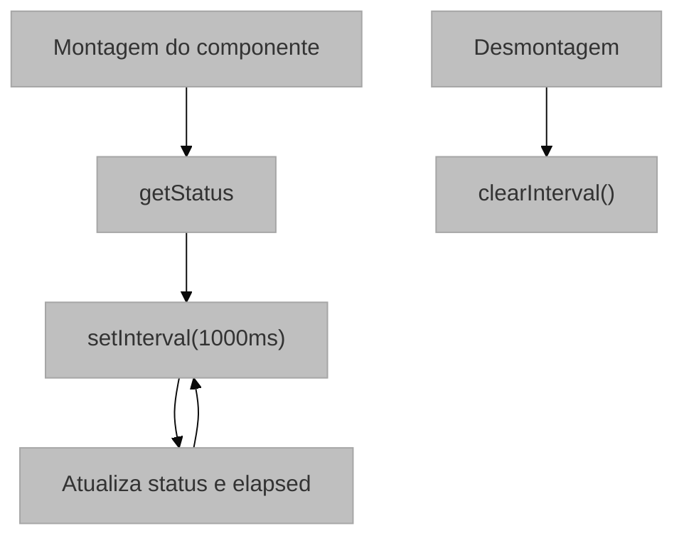
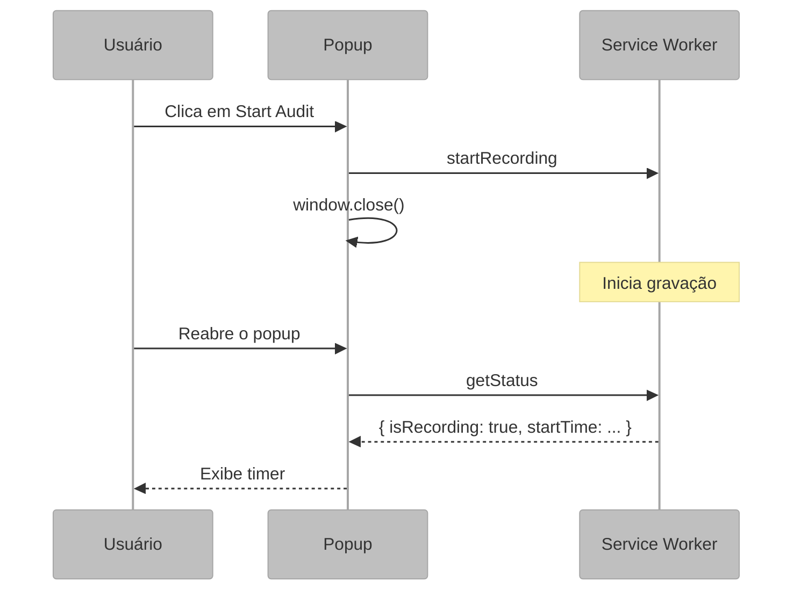

# Interface do Popup (Popup.jsx)

## 1. Visão Geral e Propósito

O componente [`Popup.jsx`](../src/popup/Popup.jsx) implementa a interface de usuário da extensão, apresentada ao usuário quando o ícone da extensão é clicado na barra de ferramentas do Chrome. Desenvolvido em React, este componente oferece controles para iniciar e interromper sessões de gravação, além de exibir o status atual e o tempo decorrido.

### 1.1 Papel no Sistema

O Popup desempenha as seguintes responsabilidades:

1. **Interface de Controle**: permite ao usuário iniciar e parar gravações
2. **Visualização de Status**: exibe o estado atual da sessão
3. **Cronômetro em Tempo Real**: mostra tempo decorrido durante gravação
4. **Comunicação com Background**: envia comandos e recebe atualizações de estado

### 1.2 Integração com o Sistema

```mermaid
%%{init: {'theme': 'base', 'themeVariables': { 'primaryColor': '#bfbfbf', 'edgeColor': '#5d5d5d' }, "flowchart": {"subGraphTitleMargin": {"bottom": 30}}}}%%
flowchart TB
    subgraph POPUP ["POPUP (React Component)"]
        subgraph Estado ["Estado Local"]
            direction TB
            S1["status: { isRecording, startTime }"]
            S2["elapsed: 'MM:SS'"]
        end

        subgraph UI ["UI Components"]
            direction TB
            U1["Header (Logo + Título)"]
            U2["Status Card (Timer + Indicador)"]
            U3["Action Button (Start/Stop)"]
        end
    end

    subgraph SW ["SERVICE WORKER"]
        Background["background.js"]
    end

    POPUP <-->|chrome.runtime.sendMessage()| SW
```

## 2. Arquitetura e Lógica

### 2.1 Estrutura de Componentes

```
Popup (Componente Principal)
├── Header
│   ├── Logo Indicator
│   └── Título "UX Auditor"
├── Status Card
│   ├── Status Label
│   └── Timer Container
│       ├── Pulse Animation (quando gravando)
│       └── Timer Display
└── Action Button
    ├── "Start Audit" (estado inativo)
    └── "Stop Recording" (estado ativo)
```

### 2.2 Modelo de Estado

O componente utiliza dois estados locais:

```javascript
// Estado principal sincronizado com o Background
const [status, setStatus] = useState({ 
  isRecording: false, 
  startTime: null 
});

// Tempo formatado para exibição
const [elapsed, setElapsed] = useState('00:00');
```

### 2.3 Ciclo de Vida com `useEffect`

O `useEffect` faz duas coisas:

1. Pergunta o estado atual ao abrir o popup
2. Agenda uma consulta a cada segundo para atualizar o timer

```javascript
useEffect(() => {
  chrome.runtime.sendMessage({ action: 'getStatus' }, (response) => {
    setStatus(response);
  });

  const interval = setInterval(() => {
    chrome.runtime.sendMessage({ action: 'getStatus' }, (res) => {
      if (res.isRecording && res.startTime) {
        const secs = Math.floor((Date.now() - res.startTime) / 1000);
        const m = Math.floor(secs / 60).toString().padStart(2, '0');
        const s = (secs % 60).toString().padStart(2, '0');
        setElapsed(`${m}:${s}`);
      }
      setStatus(res);
    });
  }, 1000);

  return () => clearInterval(interval);
}, []);
```



### 2.4 Fluxo de Interação



## 3. Fundamentação Matemática

### 3.1 Cálculo do Tempo Decorrido

$$
\Delta t = t_{\text{atual}} - t_{\text{início}}
$$

$$
\text{minutos} = \left\lfloor \frac{\Delta t}{60} \right\rfloor
$$

$$
\text{segundos} = \Delta t \mod 60
$$

**Implementação**:

```javascript
const secs = Math.floor((Date.now() - res.startTime) / 1000);
const m = Math.floor(secs / 60).toString().padStart(2, '0');
const s = (secs % 60).toString().padStart(2, '0');
```

### 3.2 Frequência de Polling

O popup consulta o background a cada 1000ms:

$$
f_{\text{polling}} = \frac{1}{1\text{ s}} = 1\text{ Hz}
$$

### 3.3 Latência de Atualização

$$
L_{\text{max}} = T_{\text{interval}} + T_{\text{mensagem}} + T_{\text{render}}
$$

## 4. Parâmetros Técnicos

### 4.1 Configurações de Estado

| Estado | Tipo | Valores Possíveis |
|--------|------|-------------------|
| `status.isRecording` | boolean | `true`, `false` |
| `status.startTime` | number \| null | timestamp Unix ou `null` |
| `elapsed` | string | `MM:SS` |

### 4.2 Intervalos de Tempo

| Parâmetro | Valor | Descrição |
|-----------|-------|-----------|
| Polling interval | 1000ms | Atualização do estado e do timer |
| Formato do timer | `MM:SS` | Minutos e segundos com padding |

### 4.3 Mensagens Chrome

| Ação Enviada | Parâmetros | Resposta Esperada |
|--------------|------------|-------------------|
| `getStatus` | nenhum | `{ isRecording, startTime }` |
| `startRecording` | `tabId` | nenhuma; o popup fecha |
| `stopRecording` | nenhum | nenhuma; o popup fecha |

## 5. Mapeamento Tecnológico e Referências

### 5.1 React

**Documentação Oficial**: https://react.dev/

```bibtex
@inproceedings{react2013,
  author = {Facebook Inc.},
  title = {React: A JavaScript Library for Building User Interfaces},
  year = {2013},
  url = {https://react.dev/}
}
```

```bibtex
@online{react_hooks,
  author = {{React Team}},
  title = {Introducing Hooks},
  year = {2019},
  url = {https://react.dev/reference/react}
}
```

### 5.2 React Hooks Utilizados

| Hook | Uso | Documentação |
|------|-----|--------------|
| `useState` | Estado local do popup | https://react.dev/reference/react/useState |
| `useEffect` | Sincronização periódica | https://react.dev/reference/react/useEffect |

### 5.3 Chrome Runtime API

**Documentação**: https://developer.chrome.com/docs/extensions/reference/api/runtime

## 6. Análise do Código

### 6.1 Função `handleStart()`

`handleStart()` consulta a aba ativa, envia `startRecording` ao background e fecha o popup para não ocupar espaço durante a gravação.

**Algoritmo**:

```
1. Obter aba ativa via chrome.tabs.query()
2. Enviar mensagem 'startRecording' ao Background
3. Fechar popup via window.close()
```

### 6.2 Função `handleStop()`

`handleStop()` envia `stopRecording` ao background e também fecha o popup.

### 6.3 Efeito de Sincronização

O componente usa polling para manter o timer visível e coerente com o estado persistido no background.

### 6.4 Renderização Condicional

```jsx
{status.isRecording ? (
  <button className="popup-btn danger" onClick={handleStop}>
    Stop Recording
  </button>
) : (
  <button className="popup-btn primary" onClick={handleStart}>
    Start Audit
  </button>
)}
```

## 7. Análise de Estilos (popup.css)

### 7.1 Sistema de Design

O arquivo [`popup.css`](../src/popup/popup.css) define um sistema de design baseado em CSS Custom Properties:

```css
:root {
  --primary: #3f9c13;
  --danger: #ef4444;
  --bg: #ffffff;
  --text: #1f2937;
  --text-light: #6b7280;
  --success: #22c55e;
  --shadow: ...;
}
```

### 7.2 Animação Pulse

Uma animação de pulso destaca a sessão em andamento.

```css
@keyframes pulse {
  0% { transform: scale(0.95); opacity: 1; }
  70% { transform: scale(1.1); opacity: 0.7; }
  100% { transform: scale(0.95); opacity: 1; }
}
```

**Ciclo de Animação**:

$$
\text{scale}(t) = \begin{cases}
0.95 & t = 0 \\
1.1 & t = 0.7 \times 1.5\text{s} = 1.05\text{s} \\
0.95 & t = 1.5\text{s}
\end{cases}
$$

### 7.3 Dimensões do Popup

| Elemento | Dimensão | Valor |
|----------|----------|-------|
| Container | Largura | 250px |
| Container | Padding | 20px |
| Timer | Font-size | 28px |
| Button | Padding | 12px |

## 8. Justificativa de Escolhas

### 8.1 React vs Vanilla JavaScript

| Aspecto | React | Vanilla JS |
|---------|-------|------------|
| Gerenciamento de estado | Declarativo | Imperativo |
| Reutilização | Componentes | Funções |
| Curva de aprendizado | Moderada | Baixa |
| Bundle size | Maior | Menor |

**Decisão**: React foi escolhido pela familiaridade da equipe e pela facilidade de gerenciar estado em interfaces que mudam frequentemente.

### 8.2 Polling vs Event-Driven

| Abordagem | Vantagens | Desvantagens |
|-----------|-----------|--------------|
| **Polling** | Simplicidade, não requer registro de listeners | Uso de recursos, latência |
| **Event-driven** | Eficiência, resposta imediata | Complexidade, gerenciamento de listeners |

**Decisão**: Polling foi escolhido pela simplicidade de implementação. Uma melhoria futura poderia usar `chrome.runtime.onMessage` para atualizações push do Background.

### 8.3 Fechamento do Popup

Fechar o popup após iniciar ou parar a gravação evita interferência visual na página em análise.

**Vantagens**:
- Não obstrui a visualização da página
- Indica claramente que a ação foi executada
- Segue padrões de UX para extensões Chrome

## 9. Considerações para Monografia

### 9.1 Seções Sugeridas

```latex
\section{Interface do Usuário}
\subsection{Arquitetura do Componente Popup}
\subsection{Gerenciamento de Estado com React Hooks}
\subsection{Sistema Visual}
\subsection{Comunicação com o Service Worker}
```

### 9.2 Diagramas Recomendados

- Diagrama de estados do componente
- Fluxograma de interação
- Sequência de comunicação com o background

### 9.3 Métricas de UX

- Tempo de resposta da interface
- Clareza do feedback visual
- Consistência do estado exibido
