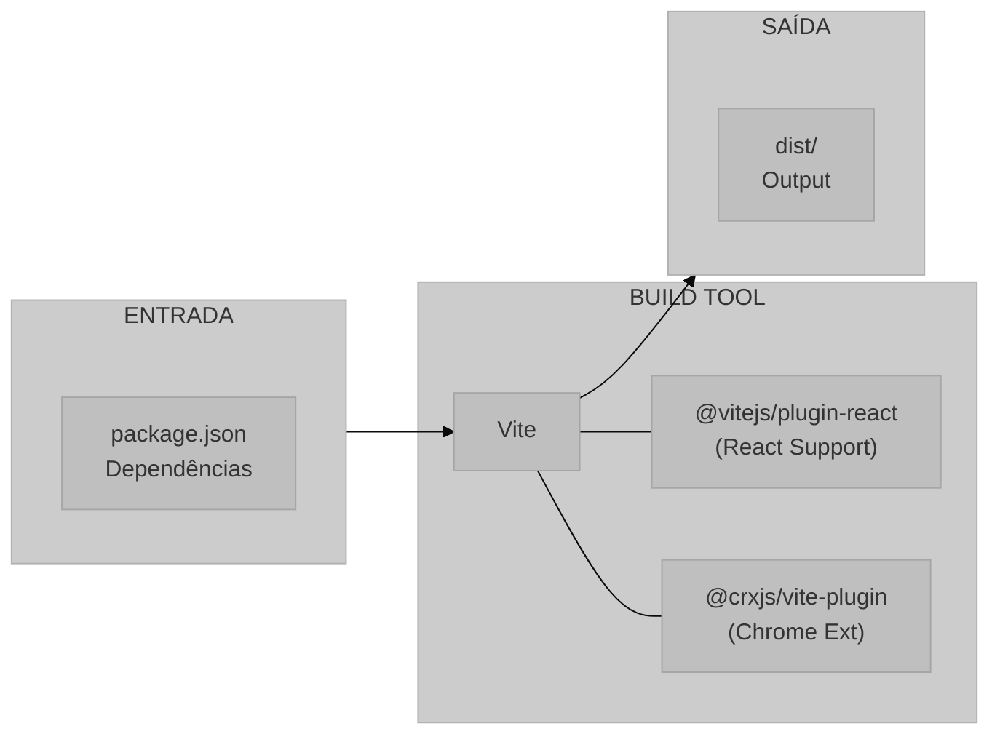
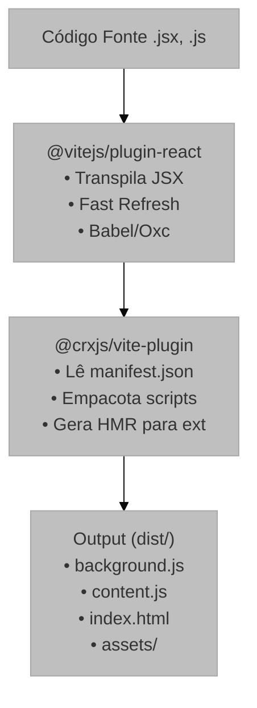
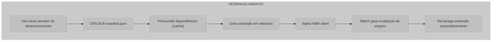
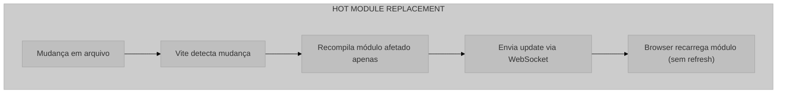
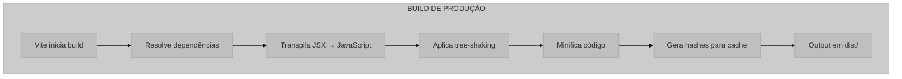
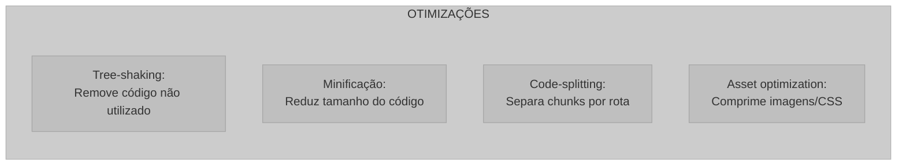

# Sistema de Build e Configuração

## 1. Visão Geral e Propósito

Este documento descreve a infraestrutura de build e configuração do projeto UX Auditor Extension, abrangendo os arquivos [`package.json`](../package.json) e [`vite.config.js`](../vite.config.js). O sistema utiliza ferramentas modernas de desenvolvimento frontend para proporcionar um ambiente de desenvolvimento eficiente com Hot Module Replacement (HMR) e build otimizado para produção.

### 1.1 Papel no Sistema

Os arquivos de configuração desempenham as seguintes responsabilidades:

1. **Gerenciamento de Dependências**: Define bibliotecas e versões utilizadas
2. **Scripts de Automação**: Comandos para desenvolvimento, build e linting
3. **Configuração de Build**: Otimização e empacotamento do código
4. **Integração Chrome Extension**: Adaptação do build para o formato de extensão

### 1.2 Stack de Build

**Diagrama do fluxo de build, da entrada de dependências até a geração do diretório de saída (dist).**



## 2. Análise do package.json

### 2.1 Metadados do Projeto

```json
{
  "name": "ux-auditor-extension",
  "private": true,
  "version": "0.0.0",
  "type": "module"
}
```

| Campo | Valor | Descrição |
|-------|-------|-----------|
| `name` | `ux-auditor-extension` | Identificador do pacote |
| `private` | `true` | Impede publicação acidental no npm |
| `version` | `0.0.0` | Versão semântica (desenvolvimento) |
| `type` | `module` | Usa ES Modules como padrão |

### 2.2 Scripts de Automação

```json
{
  "scripts": {
    "dev": "vite",
    "build": "vite build",
    "lint": "eslint .",
    "preview": "vite preview"
  }
}
```

| Script | Comando | Descrição |
|--------|---------|-----------|
| `dev` | `vite` | Inicia servidor de desenvolvimento com HMR |
| `build` | `vite build` | Gera build de produção em `dist/` |
| `lint` | `eslint .` | Executa análise estática de código |
| `preview` | `vite preview` | Pré-visualiza build de produção |

### 2.3 Dependências de Produção

```json
{
  "dependencies": {
    "react": "^19.2.0",
    "react-dom": "^19.2.0",
    "rrweb": "^2.0.0-alpha.4"
  }
}
```

| Dependência | Versão | Propósito |
|-------------|--------|-----------|
| `react` | ^19.2.0 | Biblioteca de UI |
| `react-dom` | ^19.2.0 | Renderização React no DOM |
| `rrweb` | ^2.0.0-alpha.4 | Captura e reprodução de sessões |

**Notação de Versão**:

O prefixo `^` indica compatibilidade com versões superiores dentro do mesmo major:

$$
\text{versão permitida} = \begin{cases}
\text{aceita} & \text{se } \text{major} = 19 \land \text{minor} \geq 2 \\
\text{rejeita} & \text{caso contrário}
\end{cases}
$$

### 2.4 Dependências de Desenvolvimento

```json
{
  "devDependencies": {
    "@crxjs/vite-plugin": "^2.0.0-beta.33",
    "@eslint/js": "^9.39.1",
    "@types/react": "^19.2.5",
    "@types/react-dom": "^19.2.3",
    "@vitejs/plugin-react": "^5.1.1",
    "eslint": "^9.39.1",
    "eslint-plugin-react-hooks": "^7.0.1",
    "eslint-plugin-react-refresh": "^0.4.24",
    "globals": "^16.5.0",
    "vite": "^7.2.4"
  }
}
```

| Dependência | Versão | Propósito |
|-------------|--------|-----------|
| `vite` | ^7.2.4 | Build tool principal |
| `@vitejs/plugin-react` | ^5.1.1 | Suporte a React com Fast Refresh |
| `@crxjs/vite-plugin` | ^2.0.0-beta.33 | Integração Chrome Extension |
| `eslint` | ^9.39.1 | Análise estática de código |
| `@eslint/js` | ^9.39.1 | Configurações base do ESLint |
| `eslint-plugin-react-hooks` | ^7.0.1 | Linting para React Hooks |
| `eslint-plugin-react-refresh` | ^0.4.24 | Linting para React Fast Refresh |
| `@types/react` | ^19.2.5 | Tipos TypeScript para React |
| `@types/react-dom` | ^19.2.3 | Tipos TypeScript para React DOM |
| `globals` | ^16.5.0 | Variáveis globais para ESLint |

## 3. Análise do vite.config.js

### 3.1 Estrutura de Configuração

```javascript
import { defineConfig } from 'vite'
import react from '@vitejs/plugin-react'
import { crx } from '@crxjs/vite-plugin'
import manifest from './manifest.json'

export default defineConfig({
  plugins: [
    react(),
    crx({ manifest }),
  ],
})
```

### 3.2 Pipeline de Plugins

**Pipeline de plugins do Vite para processamento de React e suporte a extensões Chrome.**



### 3.3 Função `defineConfig()`

A função `defineConfig()` fornece tipagem TypeScript e autocompletar:

$$
\text{defineConfig} : \text{UserConfig} \rightarrow \text{UserConfig}
$$

É uma função identidade com propósito de documentação:

$$
\forall c \in \text{UserConfig}: \text{defineConfig}(c) = c
$$

## 4. Fundamentação Matemática

### 4.1 Resolução de Módulos ES

O sistema utiliza ES Modules (ESM) como padrão. A resolução de imports segue:

$$
\text{resolução}(\text{import } M) = \begin{cases}
\text{node\_modules}/M & \text{se } M \text{ é dependência} \\
\text{caminho relativo}/M & \text{se } M \text{ é local}
\end{cases}
$$

### 4.2 Bundle Size

O tamanho do bundle final pode ser estimado:

$$
\text{Bundle}_{\text{total}} = \sum_{i=1}^{n} \text{Size}(\text{dep}_i) + \text{Size}(\text{code}) - \text{TreeShaking}
$$

Onde `TreeShaking` representa a redução por eliminação de código não utilizado.

### 4.3 Tempo de Build

O tempo de build é afetado por:

$$
T_{\text{build}} = T_{\text{parse}} + T_{\text{transform}} + T_{\text{bundle}} + T_{\text{minify}}
$$

Vite otimiza isso através de:
- **ESBuild**: Parser/transformer mais rápido que Babel
- **Caching**: Cache de dependências pré-bundled
- **Parallelismo**: Processamento paralelo de módulos

## 5. Parâmetros Técnicos

### 5.1 Configurações do Vite (Implícitas)

| Configuração | Valor Padrão | Descrição |
|--------------|--------------|-----------|
| `root` | `.` | Diretório raiz do projeto |
| `outDir` | `dist` | Diretório de saída |
| `sourcemap` | `false` | Geração de sourcemaps |
| `minify` | `esbuild` | Minificador padrão |

### 5.2 Configurações do Plugin React

| Configuração | Valor Padrão | Descrição |
|--------------|--------------|-----------|
| `jsxRuntime` | `automatic` | Runtime JSX (React 17+) |
| `fastRefresh` | `true` | Hot Module Replacement |

### 5.3 Configurações do CRXJS Plugin

| Configuração | Valor | Descrição |
|--------------|-------|-----------|
| `manifest` | Importado | Manifesto da extensão |
| `contentScripts` | Auto | Injetados automaticamente |

## 6. Mapeamento Tecnológico e Referências

### 6.1 Vite

**Documentação Oficial**: https://vite.dev/

**Repositório GitHub**: https://github.com/vitejs/vite

**Citação (BibTeX)**:
```bibtex
@misc{vite2024,
  author = {{Vite Team}},
  title = {Vite: Next Generation Frontend Tooling},
  year = {2024},
  url = {https://vite.dev/}
}
```

**Artigo sobre ESM-first**:
```bibtex
@online{vite_why,
  author = {{Evan You}},
  title = {Why Vite?},
  year = {2024},
  url = {https://vite.dev/guide/why.html}
}
```

### 6.2 React

**Documentação Oficial**: https://react.dev/

**Citação (BibTeX)**:
```bibtex
@inproceedings{react2013,
  author = {{Facebook Inc.}},
  title = {React: A JavaScript Library for Building User Interfaces},
  year = {2013},
  url = {https://react.dev/}
}
```

### 6.3 CRXJS Vite Plugin

**Documentação**: https://crxjs.dev/vite-plugin/

**Repositório GitHub**: https://github.com/crxjs/chrome-extension-tools

**Citação (BibTeX)**:
```bibtex
@misc{crxjs2024,
  author = {{CRXJS Team}},
  title = {CRXJS Vite Plugin: Build Chrome Extensions with Vite},
  year = {2024},
  url = {https://crxjs.dev/vite-plugin/}
}
```

### 6.4 ESLint

**Documentação**: https://eslint.org/

**Citação (BibTeX)**:
```bibtex
@misc{eslint2024,
  author = {{ESLint Team}},
  title = {ESLint: Find and Fix Problems in JavaScript Code},
  year = {2024},
  url = {https://eslint.org/}
}
```

### 6.5 ESBuild

**Documentação**: https://esbuild.github.io/

**Citação (BibTeX)**:
```bibtex
@misc{esbuild2020,
  author = {Evan Wallace},
  title = {esbuild: An Extremely Fast JavaScript Bundler},
  year = {2020},
  url = {https://esbuild.github.io/}
}
```

## 7. Análise do Fluxo de Build

### 7.1 Modo Desenvolvimento (`npm run dev`)

**Fluxo do processo de build em modo desenvolvimento com suporte a Hot Module Replacement (HMR).**



**Fluxograma do mecanismo de Hot Module Replacement (HMR) para atualizações instantâneas.**



### 7.2 Modo Produção (`npm run build`)

**Etapas do processo de build para produção, focando em otimização e minificação.**



**Lista de otimizações aplicadas durante a geração do bundle de produção.**



### 7.3 Output do Build

```
dist/
├── index.html              # Popup HTML
├── src/
│   ├── popup/
│   │   ├── index.js        # Bundle do popup
│   │   └── index.css       # Estilos extraídos
│   └── scripts/
│       ├── background.js   # Service Worker
│       └── content.js      # Content Script
├── manifest.json           # Manifesto processado
└── assets/                 # Recursos estáticos
```

## 8. Justificativa de Escolhas

### 8.1 Vite vs Webpack

| Aspecto | Vite | Webpack |
|---------|------|---------|
| Velocidade dev | Muito rápido (ESBuild) | Moderado |
| Configuração | Mínima | Extensa |
| Ecosystem | Crescente | Maduro |
| HMR | Instantâneo | Mais lento |

**Decisão**: Vite foi escolhido pela velocidade de desenvolvimento e configuração simplificada.

### 8.2 CRXJS vs Configuração Manual

| Abordagem | Vantagens | Desvantagens |
|-----------|-----------|--------------|
| **CRXJS** | HMR automático, manifest integration | Beta, possível instabilidade |
| **Manual** | Controle total | Complexo, sem HMR |

**Decisão**: CRXJS foi escolhido para integração transparente entre Vite e Chrome Extensions, permitindo HMR durante desenvolvimento.

### 8.3 React 19

A versão 19 do React introduz melhorias significativas:

- **React Compiler Ready**: Otimizações automáticas
- **Improved Hooks**: Melhor performance de useEffect
- **Server Components**: Suporte (não utilizado neste projeto)

## 9. Considerações para Monografia

### 9.1 Seções Sugeridas

```latex
\section{Infraestrutura de Desenvolvimento}
\subsection{Sistema de Build}
\subsubsection{Vite: Build Tool Moderno}
\subsubsection{ESBuild e Performance}
\subsection{Integração Chrome Extension}
\subsubsection{CRXJS Vite Plugin}
\subsubsection{Hot Module Replacement}
\subsection{Qualidade de Código}
\subsubsection{ESLint e Análise Estática}
\subsection{Gerenciamento de Dependências}
\subsubsection{Versionamento Semântico}
\subsubsection{Dependências de Produção vs Desenvolvimento}
```

### 9.2 Comparativos Técnicos

Sugere-se incluir tabelas comparativas:
- Vite vs Webpack vs Parcel
- React vs Vue vs Svelte
- ESBuild vs Babel vs SWC

### 9.3 Métricas de Performance

Documentar:
- Tempo de cold start
- Tempo de hot reload
- Tamanho do bundle de produção
- Número de dependências
