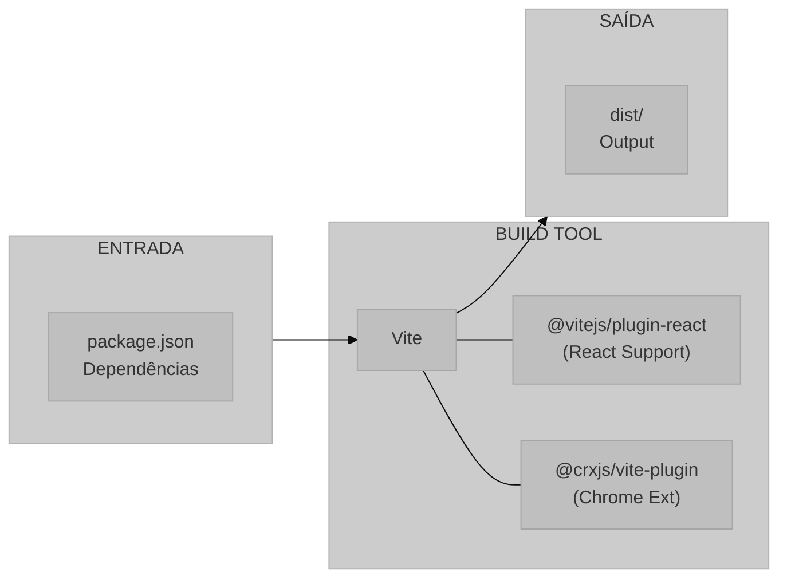
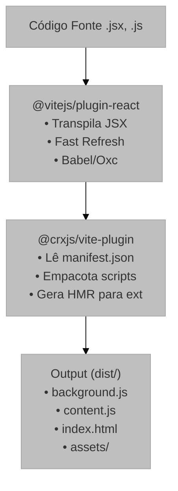
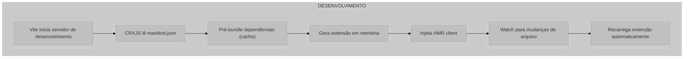
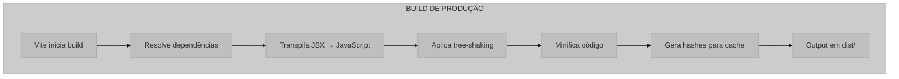

# Sistema de Build e Configuração

## 1. Visão Geral e Propósito

Este documento descreve a infraestrutura de build e configuração do projeto UX Auditor Extension, abrangendo os arquivos [`package.json`](../package.json) e [`vite.config.js`](../vite.config.js). O sistema utiliza ferramentas modernas de desenvolvimento frontend para proporcionar um ambiente de desenvolvimento eficiente com Hot Module Replacement (HMR) e build otimizado para produção.

### 1.1 Papel no Sistema

Os arquivos de configuração definem:

1. **Gerenciamento de Dependências**: define bibliotecas e versões utilizadas
2. **Scripts de Automação**: comandos para desenvolvimento, build e linting
3. **Configuração de Build**: otimização e empacotamento do código
4. **Integração Chrome Extension**: adaptação do build para o formato de extensão

### 1.2 Stack de Build



## 2. Análise do package.json

### 2.1 Metadados do Projeto

```json
{
  "name": "ux-auditor-extension",
  "private": true,
  "version": "0.0.0",
  "type": "module"
}
```

| Campo | Valor | Descrição |
|-------|-------|-----------|
| `name` | `ux-auditor-extension` | Identificador do projeto |
| `private` | `true` | Evita publicação acidental no npm |
| `version` | `0.0.0` | Versão de desenvolvimento |
| `type` | `module` | Usa ES Modules por padrão |

**Notação de Versão**:

O prefixo `^` indica compatibilidade com versões superiores dentro do mesmo major:

$$
\text{versão permitida} = \begin{cases}
\text{aceita} & \text{se } \text{major} = 19 \land \text{minor} \geq 2 \\
\text{rejeita} & \text{caso contrário}
\end{cases}
$$

### 2.2 Scripts de Automação

```json
{
  "scripts": {
    "dev": "vite",
    "build": "vite build",
    "lint": "eslint .",
    "preview": "vite preview"
  }
}
```

| Script | Comando | Descrição |
|--------|---------|-----------|
| `dev` | `vite` | Servidor de desenvolvimento com HMR |
| `build` | `vite build` | Geração da build de produção |
| `lint` | `eslint .` | Análise estática do código |
| `preview` | `vite preview` | Pré-visualização da build |

### 2.3 Dependências de Produção

```json
{
  "dependencies": {
    "axe-core": "^4.10.0",
    "react": "^19.2.0",
    "react-dom": "^19.2.0",
    "rrweb": "^2.0.0-alpha.4"
  }
}
```

| Dependência | Versão | Propósito |
|-------------|--------|-----------|
| `axe-core` | ^4.10.0 | Análise preliminar de acessibilidade |
| `react` | ^19.2.0 | Biblioteca de interface |
| `react-dom` | ^19.2.0 | Renderização no DOM |
| `rrweb` | ^2.0.0-alpha.4 | Captura e replay de sessões |

### 2.4 Dependências de Desenvolvimento

| Dependência | Versão | Propósito |
|-------------|--------|-----------|
| `vite` | ^7.2.4 | Build tool principal |
| `@vitejs/plugin-react` | ^5.1.1 | Suporte a React e Fast Refresh |
| `@crxjs/vite-plugin` | ^2.0.0-beta.33 | Integração com Chrome Extensions |
| `eslint` | ^9.39.1 | Análise estática |
| `@eslint/js` | ^9.39.1 | Regras base do ESLint |
| `eslint-plugin-react-hooks` | ^7.0.1 | Regras para hooks |
| `eslint-plugin-react-refresh` | ^0.4.24 | Regras para Fast Refresh |
| `@types/react` | ^19.2.5 | Tipos TypeScript para React |
| `@types/react-dom` | ^19.2.3 | Tipos TypeScript para React DOM |
| `globals` | ^16.5.0 | Globais para o ESLint |

## 3. Análise do vite.config.js

### 3.1 Estrutura de Configuração

```javascript
import { defineConfig } from 'vite';
import react from '@vitejs/plugin-react';
import { crx } from '@crxjs/vite-plugin';
import manifest from './manifest.json';

export default defineConfig({
  plugins: [
    react(),
    crx({ manifest }),
  ],
});
```

### 3.2 Pipeline de Plugins



### 3.3 Função `defineConfig()`

`defineConfig()` melhora a ergonomia de configuração do Vite, oferecendo validação e autocompletar do objeto de build.

$$
\text{defineConfig} : \text{UserConfig} \rightarrow \text{UserConfig}
$$

É uma função identidade com propósito de documentação:

$$
\forall c \in \text{UserConfig}: \text{defineConfig}(c) = c
$$

## 4. Fundamentação Matemática

### 4.1 Resolução de Módulos ES

$$
\text{resolução}(\text{import } M) =
\begin{cases}
\text{node\_modules}/M & \text{se } M \text{ é dependência} \\
\text{caminho relativo}/M & \text{se } M \text{ é local}
\end{cases}
$$

### 4.2 Bundle Size

$$
\text{Bundle}_{\text{total}} = \sum_{i=1}^{n} \text{Size}(\text{dep}_i) + \text{Size}(\text{code}) - \text{TreeShaking}
$$

### 4.3 Tempo de Build

$$
T_{\text{build}} = T_{\text{parse}} + T_{\text{transform}} + T_{\text{bundle}} + T_{\text{minify}}
$$

Vite otimiza isso através de:
- **ESBuild**: parser/transformer mais rápido que Babel
- **Caching**: cache de dependências pré-bundled
- **Parallelismo**: processamento paralelo de módulos

## 5. Parâmetros Técnicos

### 5.1 Configurações do Vite (Implícitas)

| Configuração | Valor Padrão | Descrição |
|--------------|--------------|-----------|
| `root` | `.` | Diretório raiz do projeto |
| `outDir` | `dist` | Diretório de saída |
| `sourcemap` | `false` | Geração de sourcemaps |
| `minify` | `esbuild` | Minificador padrão |

### 5.2 Configurações do Plugin React

| Configuração | Valor | Descrição |
|--------------|-------|-----------|
| `jsxRuntime` | `automatic` | Runtime JSX automático |
| `fastRefresh` | `true` | Atualização rápida durante desenvolvimento |

### 5.3 Configurações do CRXJS Plugin

| Configuração | Valor | Descrição |
|--------------|-------|-----------|
| `manifest` | Importado | Manifesto da extensão |
| `contentScripts` | Automático | Injeção dos scripts declarados |


## 6. Análise do Fluxo de Build

### 6.1 Modo Desenvolvimento (`npm run dev`)

**Fluxo do processo de build em modo desenvolvimento com suporte a Hot Module Replacement (HMR).**



### 6.2 Modo Produção (`npm run build`)



### 6.3 Output do Build

```
dist/
├── index.html
├── manifest.json
├── assets/
├── background.js
└── content.js
```

## 7. Justificativa de Escolhas

### 7.1 Vite vs Webpack

Vite foi escolhido pela velocidade de desenvolvimento, configuração enxuta e integração mais simples com o fluxo de extensão.

### 7.2 CRXJS vs Configuração Manual

CRXJS reduz a complexidade de manter um pipeline manual de extensão Chrome durante o desenvolvimento.

### 7.3 React 19

React 19 mantém a interface do popup simples e compatível com o ecossistema atual do projeto.

## 8. Considerações para Monografia

### 8.1 Seções Sugeridas

```latex
\section{Infraestrutura de Desenvolvimento}
\subsection{Sistema de Build}
\subsection{Integração Chrome Extension}
\subsection{Qualidade de Código}
\subsection{Gerenciamento de Dependências}
```

### 8.2 Comparativos Técnicos

- Vite vs Webpack
- React vs Vue vs Svelte
- ESBuild vs Babel vs SWC

### 8.3 Métricas de Performance

- Tempo de cold start
- Tempo de hot reload
- Tamanho do bundle
- Número de dependências

## 9. Referências


**Documentação Oficial**: https://vite.dev/

```bibtex
@misc{vite2024,
  author = {{Vite Team}},
  title = {Vite: Next Generation Frontend Tooling},
  year = {2024},
  url = {https://vite.dev/}
}
```

```bibtex
@online{vite_why,
  author = {{Evan You}},
  title = {Why Vite?},
  year = {2024},
  url = {https://vite.dev/guide/why.html}
}
```

**Documentação Oficial**: https://react.dev/

```bibtex
@inproceedings{react2013,
  author = {{Facebook Inc.}},
  title = {React: A JavaScript Library for Building User Interfaces},
  year = {2013},
  url = {https://react.dev/}
}
```

**Documentação**: https://crxjs.dev/vite-plugin/

```bibtex
@misc{crxjs2024,
  author = {{CRXJS Team}},
  title = {CRXJS Vite Plugin: Build Chrome Extensions with Vite},
  year = {2024},
  url = {https://crxjs.dev/vite-plugin/}
}
```

**Documentação**: https://eslint.org/

```bibtex
@misc{eslint2024,
  author = {{ESLint Team}},
  title = {ESLint: Find and Fix Problems in JavaScript Code},
  year = {2024},
  url = {https://eslint.org/}
}
```

**Documentação**: https://esbuild.github.io/

```bibtex
@misc{esbuild2020,
  author = {Evan Wallace},
  title = {esbuild: An Extremely Fast JavaScript Bundler},
  year = {2020},
  url = {https://esbuild.github.io/}
}
```