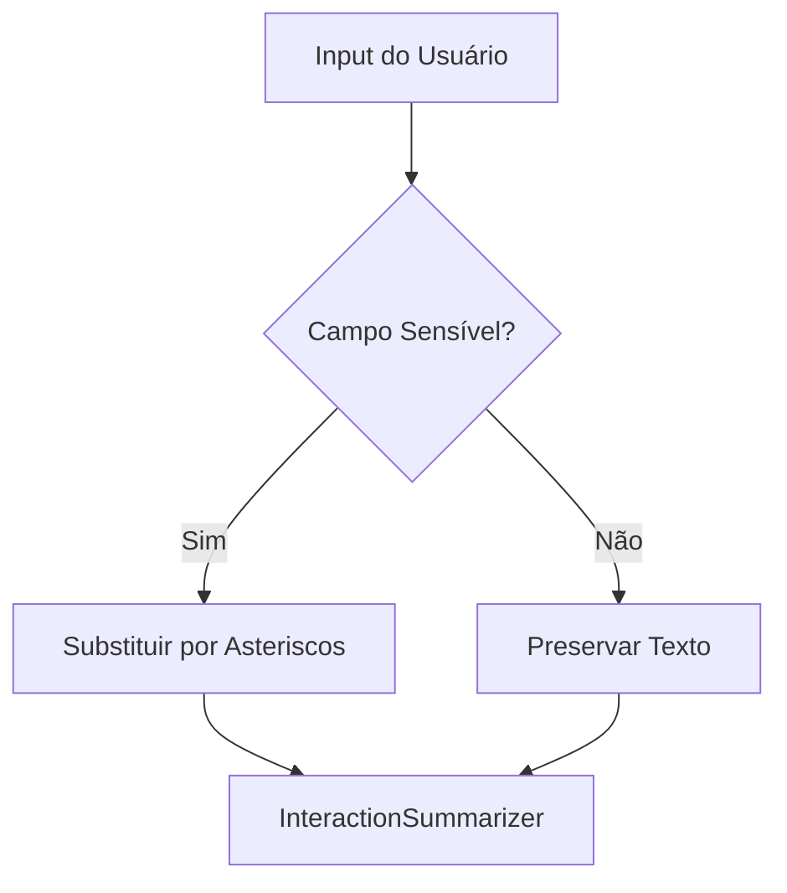

# Privacidade, Mascaramento e Acessibilidade

O UX Auditor implementa camadas rigorosas de proteção de dados e auditoria de acessibilidade para garantir que a coleta de dados seja ética e tecnicamente robusta.

## 1. Mascaramento Seletivo de Dados (`sensitive-masking.js`)

Para garantir a conformidade com leis de proteção de dados (LGPD), o sistema utiliza uma lógica de mascaramento baseada no contexto do campo:

### Critérios de Mascaramento:
O script identifica campos sensíveis através de múltiplos sinais:
-   **Atributo `type`**: `password`, `email`, `tel`.
-   **Atributo `autocomplete`**: `cc-number`, `username`, `current-password`.
-   **Nome ou ID**: Termos como `cpf`, `documento`, `cartao`, `senha`, `login`.
-   **Heurística de Valor**: Se o texto digitado aparenta ser um cartão de crédito ou CPF (regex simples), ele é mascarado mesmo que o campo não tenha metadados explícitos.

---

## 2. Auditoria de Acessibilidade com `axe-core`

O sistema integra o motor **`axe-core`** (`axe-runner.js`) para realizar triagens WCAG preliminares.

### Quando a auditoria é disparada?
As varreduras ocorrem de forma assíncrona em checkpoints analíticos:
1.  **Carga Inicial**: Identifica problemas estruturais globais (ex: falta de `main` landmark ou título da página).
2.  **Mudança de Rota**: Valida a acessibilidade de novos componentes carregados em SPAs.
3.  **Submissão de Formulário**: Verifica se existem campos obrigatórios sem labels ou se o feedback de erro é acessível.

### Evidências Geradas:
Cada execução do `axe-core` gera um objeto `axe_preliminary_analysis`:
-   **`violations`**: Problemas críticos que impedem o uso (ex: baixo contraste, falta de `alt` em imagens).
-   **`passes`**: Regras validadas com sucesso, dando confiança ao pesquisador sobre a qualidade técnica da interface.

---

## 3. Heurísticas de Acessibilidade Personalizadas

Além das regras do `axe-core`, o `SemanticResolver` deriva evidências de acessibilidade de forma contínua:

-   **`missing_landmarks`**: Avisa se a página não possui marcos de navegação básicos.
-   **`placeholder_dependent_fields`**: Detecta campos que não possuem label ou nome acessível, dependendo exclusivamente do placeholder (que desaparece ao digitar).
-   **`small_click_target`**: Identifica alvos interativos com área inferior a **44x44px**, dificultando o clique por usuários com dificuldades motoras ou em dispositivos móveis.

---

## 4. Próximos Passos
O resultado consolidado de todas estas análises (RRWeb, Heurísticas, Axe, Semântica) é estruturado no [Payload de Exportação](08-payload-e-schema.md).
