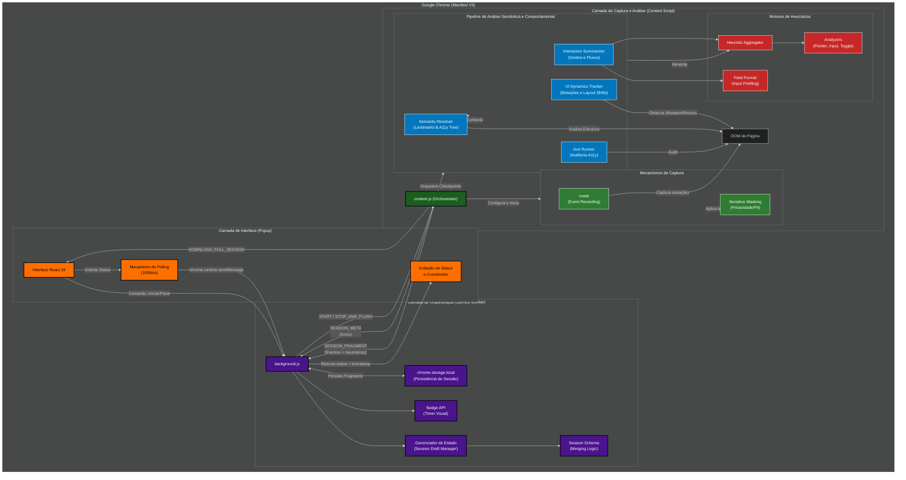

# Arquitetura Detalhada do UX Auditor Extension

Este documento descreve a organização interna da extensão, detalhando a comunicação entre os processos do Manifest V3 e o pipeline de análise de dados.

## Diagrama de Arquitetura

## Descrição das Camadas

### 1. Camada de Interface (Popup)
Responsável pelo controle direto do pesquisador. Utiliza **React 19** e comunica-se com o Service Worker para disparar o início e o fim da sessão. O mecanismo de polling garante que o cronômetro visual no popup esteja sincronizado com o timestamp real guardado no background.

### 2. Camada de Orquestração (Service Worker)
O "cérebro" da extensão. Como um processo persistente (embora sujeito à suspensão no Manifest V3), ele gerencia o rascunho da sessão (`Session Draft`).
- **Session Schema**: Garante que os fragmentos vindos de diferentes abas ou em momentos distintos sejam fundidos (`merge`) corretamente sem perda de integridade.
- **Storage API**: Salva o estado incrementalmente para evitar perda de dados em caso de fechamento inesperado do navegador.

### 3. Camada de Captura e Análise (Content Script)
Injetada em cada página visitada, esta camada é subdividida em três grandes motores:

- **Mecanismos de Captura**: Utiliza `rrweb` para registrar o visual e `Sensitive Masking` para aplicar regras de privacidade antes mesmo do evento sair da aba do usuário.
- **Pipeline de Análise**: Transforma eventos brutos em semântica. O `Semantic Resolver` identifica componentes ARIA, enquanto o `Interaction Summarizer` e o `UI Dynamics Tracker` analisam o comportamento e a estabilidade da interface.
- **Motores de Heurísticas**: Onde a lógica de UX reside. Analisadores especializados (Pointer, Input, Toggle) trabalham em conjunto com o `Heuristic Aggregator` para gerar alertas de fricção (ex: Rage Clicks).

## Fluxo de Comunicação

1.  **Início**: O Popup envia um comando ao Service Worker, que por sua vez notifica o Content Script.
2.  **Captura Contínua**: O Content Script envia `SESSION_FRAGMENT`s contendo eventos de replay e evidências de heurísticas detectadas em tempo real.
3.  **Checkpoints**: Em eventos chave (carga, submit, troca de rota), o `Axe Runner` e o `Semantic Resolver` realizam varreduras profundas.
4.  **Finalização**: No comando de parada, o Content Script realiza um *flush* final. O Service Worker consolida tudo e o download é disparado através do Content Script para permitir o salvamento do arquivo JSON.
